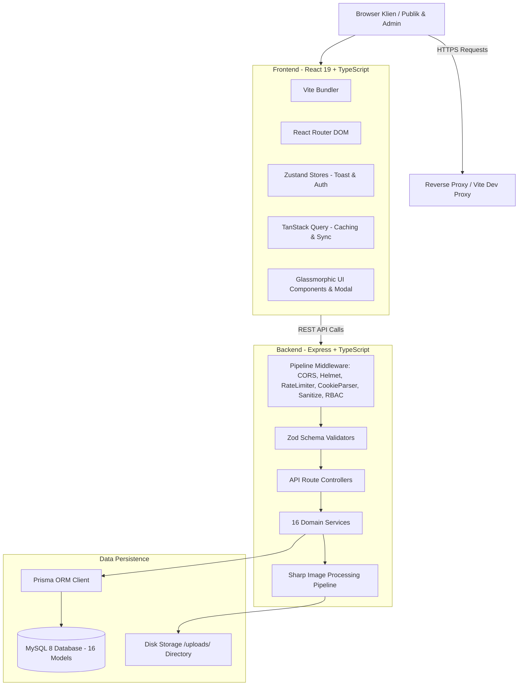

# Arsitektur Sistem (System Architecture)

## Website Profil Resmi & CMS SMKN 1 Pakuan Ratu

Dokumen ini mendeskripsikan secara menyeluruh prinsip arsitektur perangkat lunak, pola desain, alur data, dan struktur komponen dari sistem digital SMKN 1 Pakuan Ratu.

---

## 1. Filosofi & Prinsip Desain Arsitektur

Platform ini dibangun dengan berpedoman pada prinsip-prinsip rekayasa perangkat lunak modern:

1. **Clean Architecture & Separation of Concerns**: Pemisahan tegas antara antarmuka pengguna (*presentation layer*), pengarah permintaan (*routing*), validasi data (*validation layer*), logika bisnis (*service layer*), dan akses data (*data persistence layer*).
2. **Type-Safety End-to-End**: Seluruh struktur DTO, model data, skema validasi Zod, dan antarmuka komponen menggunakan TypeScript secara ketat (*strict mode*).
3. **Secure by Default**: Penerapan prinsip *defense-in-depth*, pembatasan laju (*rate limiting*), sanitasi input HTML untuk mencegah *Stored XSS*, enkripsi sesi berbasis *httpOnly cookie*, dan perlindungan kata sandi dengan Argon2id.
4. **Editorial & Modern Aesthetics**: Desain visual *Glassmorphism / Frosted Glass*, tipografi editorial (*Playfair Display & Plus Jakarta Sans*), dan peniadaan total terhadap `alert()` native JavaScript demi pengalaman pengguna yang mulus dan elegan.

---

## 2. Diagram Alur Arsitektur Tingkat Tinggi (High-Level Architecture)

---

## 3. Struktur Modul Backend

Backend diorganisir ke dalam lapisan-lapisan berorientasi layanan (*service-oriented*):

- **`src/config/`**: Konfigurasi terpusat untuk *environment variables* dan koneksi Prisma singleton.
- **`src/middleware/`**:
  - `auth.ts`: Memvalidasi sesi JWT dari cookie bertanda tangan `httpOnly` atau header `Bearer`.
  - `rbac.ts`: Memeriksa peran akses pengguna (`SUPER_ADMIN`, `ADMIN`, `STAFF`).
  - `sanitize.ts`: Melakukan sanitasi kode HTML menggunakan `sanitize-html` untuk mencegah injeksi skrip berbahaya.
  - `rateLimiter.ts`: Memproteksi rute publik, form login, dan submit formulir kontak dari serangan brute-force dan spam.
  - `upload.ts`: Mengelola unggahan berkas ke memori dan mengompresi gambar menjadi format WebP menggunakan pustaka `sharp` berkecepatan tinggi seraya membuang metadata EXIF.
  - `errorHandler.ts`: Menangkap seluruh kesalahan tak terduga tanpa membocorkan *stack trace* ke lingkungan produksi.
- **`src/services/`**: Berisi seluruh aturan bisnis independen dari protokol HTTP (memudahkan pengujian unit terisolasi). Terdiri dari 16 layanan domain:
  - `AuthService`, `AuditService`, `NewsService`, `ProgramService`, `EventService`, `AnnouncementService`, `AchievementService`, `TeacherService`, `FacilityService`, `GalleryService`, `MediaService`, `PageService`, `HomepageService`, `ContactService`, `UserService`, `SettingService`.
- **`src/routes/`**: Menghubungkan endpoint REST API dengan middleware dan memanggil *service layer*.

---

## 4. Struktur Modul Frontend

Frontend menggunakan tumpukan teknologi modern:
- **React 19 + TypeScript**: Komponen fungsional dengan hooks.
- **Tailwind CSS**: Menggunakan sistem utility-first yang dikustomisasi dengan palet warna bernuansa alam (*Forest Green*, *Emerald*, *Sand*, dan *Cream*) serta efek *Frosted Glass* (`bg-white/40 backdrop-blur-md border-white/40 shadow-sm`).
- **TanStack React Query**: Manajemen *server state*, *caching*, pembaharuan otomatis (*invalidation*), dan penanganan status *loading/error*.
- **Zustand**: Manajemen *client state* yang ringan untuk notifikasi kustom (*Toast*) dan status autentikasi admin.
- **Lucide Icons**: Ikon vektor modern beresolusi tinggi, tanpa penggunaan emotikon non-formal ataupun ikon yang dilarang.

---

## 5. Matriks Peran & Hak Akses (RBAC Matrix)

| Modul / Kemampuan | Super Admin | Humas (Admin) | Staf Sekolah | Pengunjung Publik |
| :--- | :---: | :---: | :---: | :---: |
| **Membaca Konten Publik** | Ya | Ya | Ya | Ya |
| **Mengirim Formulir Kontak** | Ya | Ya | Ya | Ya |
| **Kelola Berita & Artikel** | Penuh | Penuh | Buat Draf | Hanya Membaca |
| **Kelola Agenda & Kegiatan** | Penuh | Penuh | Hanya Membaca | Hanya Membaca |
| **Kelola Pengumuman** | Penuh | Penuh | Hanya Membaca | Hanya Membaca |
| **Kelola Prestasi Siswa** | Penuh | Penuh | Hanya Membaca | Hanya Membaca |
| **Kelola Galeri & Media** | Penuh | Penuh | Buat Draf | Hanya Membaca |
| **Kelola Halaman Statis Profil** | Penuh | Penuh | Tidak | Hanya Membaca |
| **Kelola Teks & Banner Beranda** | Penuh | Penuh | Tidak | Hanya Membaca |
| **Membaca Inbox Pesan Masuk** | Penuh | Penuh | Tidak | Tidak |
| **Manajemen Pengguna & Role** | Penuh | Tidak | Tidak | Tidak |
| **Melihat Audit Log Aktivitas** | Penuh | Tidak | Tidak | Tidak |
| **Pengaturan Identitas Sekolah**| Penuh | Tidak | Tidak | Hanya Membaca |

> **Invarian Proteksi Super Admin**: Sistem melarang penghapusan atau penonaktifan akun Super Admin terakhir untuk mencegah terjadinya *lock-out* sistem secara permanen.
