# Arsitektur Basis Data (Database Architecture & Schema)

## Website Profil Resmi & CMS SMKN 1 Pakuan Ratu

Dokumen ini mendokumentasikan skema relasional, indeks, kendala (_foreign keys_), kardinalitas, dan relasi antartabel pada basis data MySQL yang dikelola melalui Prisma ORM (`database/prisma/schema.prisma`).

---

## 1. Diagram Relasi Entitas Utama (Master ERD)

```mermaid
erDiagram
    roles ||--o{ users : "memiliki"
    roles ||--o{ role_permissions : "memiliki hak akses"
    permissions ||--o{ role_permissions : "diberikan kepada"

    users ||--o{ sessions : "membuat sesi login"
    users ||--o{ audit_logs : "mencatat aktivitas"
    users ||--o{ media : "mengunggah berkas"
    users ||--o{ news : "menulis artikel"

    news_categories ||--o{ news : "mengelompokkan"
    news ||--o{ news_tags_map : "memiliki label"
    news_tags ||--o{ news_tags_map : "diasosiasikan ke"

    programs ||--o{ teachers : "memiliki guru/instruktur"

    galleries ||--o{ gallery_items : "memuat item galeri"
    media ||--o{ gallery_items : "dijadikan berkas galeri"

    roles {
        string id PK
        string name UK
        string display_name
        text description
        datetime created_at
        datetime updated_at
    }

    permissions {
        string id PK
        string action
        string resource
        text description
        datetime created_at
    }

    role_permissions {
        string role_id PK,FK
        string permission_id PK,FK
    }

    users {
        string id PK
        string role_id FK
        string name
        string email UK
        string password_hash
        string avatar_url
        boolean is_active
        datetime last_login_at
        datetime created_at
        datetime updated_at
    }

    sessions {
        string id PK
        string user_id FK
        string token UK
        string ip_address
        text user_agent
        datetime expires_at
        datetime created_at
    }

    audit_logs {
        string id PK
        string user_id FK
        string action
        string resource
        string resource_id
        text details
        string ip_address
        text user_agent
        datetime created_at
    }

    settings {
        string id PK
        string key UK
        text value
        string type
        string group
        datetime created_at
        datetime updated_at
    }

    media {
        string id PK
        string uploader_id FK
        string filename
        string original_name
        string path
        string url
        string mime_type
        int size_bytes
        int width
        int height
        string alt_text
        text caption
        datetime created_at
        datetime updated_at
    }

    news_categories {
        string id PK
        string name UK
        string slug UK
        text description
        datetime created_at
        datetime updated_at
    }

    news_tags {
        string id PK
        string name UK
        string slug UK
        datetime created_at
    }

    news {
        string id PK
        string category_id FK
        string author_id FK
        string title
        string slug UK
        text summary
        longtext content
        string thumbnail_url
        string status
        datetime published_at
        boolean is_featured
        int views_count
        string meta_title
        text meta_desc
        datetime created_at
        datetime updated_at
    }

    news_tags_map {
        string news_id PK,FK
        string tag_id PK,FK
    }

    announcements {
        string id PK
        string title
        string slug UK
        text content
        string attachment
        boolean is_urgent
        boolean is_active
        datetime published_at
        datetime expires_at
        datetime created_at
        datetime updated_at
    }

    events {
        string id PK
        string title
        string slug UK
        text description
        string location
        datetime start_date
        datetime end_date
        string status
        string image_url
        datetime created_at
        datetime updated_at
    }

    programs {
        string id PK
        string name
        string slug UK
        string tagline
        text short_desc
        longtext full_desc
        longtext competencies
        longtext career_prospects
        longtext facilities
        string accent_color
        string icon_name
        string image_url
        int order_index
        datetime created_at
        datetime updated_at
    }

    teachers {
        string id PK
        string program_id FK
        string name
        string nip
        string position
        string subject
        text bio
        string photo_url
        int order_index
        boolean is_staff
        datetime created_at
        datetime updated_at
    }

    facilities {
        string id PK
        string name
        string category
        text description
        string location
        string image_url
        int order_index
        datetime created_at
        datetime updated_at
    }

    achievements {
        string id PK
        string title
        string student_name
        string competition
        string level
        string category
        int year
        text description
        string photo_url
        boolean is_featured
        datetime created_at
        datetime updated_at
    }

    galleries {
        string id PK
        string title
        string slug UK
        text description
        string category
        string cover_url
        datetime created_at
        datetime updated_at
    }

    gallery_items {
        string id PK
        string gallery_id FK
        string media_id FK
        text caption
        int order_index
        datetime created_at
    }

    pages {
        string id PK
        string title
        string slug UK
        longtext content
        string meta_title
        text meta_desc
        datetime created_at
        datetime updated_at
    }

    homepage_sections {
        string id PK
        string section_key UK
        string title
        text subtitle
        longtext content
        boolean is_visible
        int order_index
        datetime updated_at
    }

    contact_messages {
        string id PK
        string name
        string email
        string phone
        string subject
        text message
        boolean is_read
        string ip_address
        datetime created_at
    }
```

---

## 2. Rincian Modul & Relasi Basis Data

Skema basis data terdiri dari **23 entitas** yang terbagi ke dalam 7 modul fungsional:

### Modul 1: Autentikasi & RBAC (Role-Based Access Control)

1. **`roles`**: Menyimpan level wewenang (`SUPER_ADMIN`, `ADMIN_HUMAS`, `OPERATOR`).
2. **`permissions`**: Daftar hak akses terperinci per aksi dan sumber daya (contoh: `news:create`, `media:upload`).
3. **`role_permissions`**: Tabel persimpangan (_pivot table_) relasi _many-to-many_ antara peran dan perizinan.
4. **`users`**: Data kredensial administrator CMS (password menggunakan hashing Argon2id).
5. **`sessions`**: Pengelolaan sesi aktif, token autentikasi, serta rekaman IP dan peramban pengguna.

### Modul 2: Audit Trail & Pengaturan Sistem

6. **`audit_logs`**: Rekam jejak seluruh aktivitas administratif (login, create, update, delete, publish).
7. **`settings`**: Pasangan _key-value_ konfigurasi global website (informasi kontak, tautan sosial, SEO sekolah).

### Modul 3: Manajemen Media & Galeri

8. **`media`**: Pustaka penyimpanan berkas visual (gambar/dokumen) dengan metadata mime-type, resolusi, dan ukuran berkas.
9. **`galleries`**: Album dokumentasi visual kegiatan, fasilitas, atau praktikum siswa.
10. **`gallery_items`**: Item foto dalam album yang terhubung langsung ke entitas berkas `media`.

### Modul 4: Berita & Publikasi Artikel

11. **`news_categories`**: Kategori pengelompokan berita (contoh: Prestasi, Agenda, Ekstrakurikuler).
12. **`news_tags`**: Label kata kunci artikel untuk mempermudah pencarian dan filter.
13. **`news`**: Artikel berita lengkap dengan ringkasan, isi konten, thumbnail, workflow status (`DRAFT`, `REVIEW`, `PUBLISHED`, `ARCHIVED`), dan counter pembaca.
14. **`news_tags_map`**: Tabel asosiasi _many-to-many_ antara artikel berita dan tag.

### Modul 5: Profil Akademik & Kepegawaian

15. **`programs`**: Data 5 program keahlian/jurusan (Agribisnis Tanaman, Peternakan, Akuntansi Bisnis Digital, DKV, TBSM) lengkap dengan prospek karir dan kompetensi.
16. **`teachers`**: Direktori guru pendidik dan tenaga kependidikan (TU) dengan relasi opsional ke program keahlian.
17. **`facilities`**: Sarana dan prasarana penunjang pembelajaran di SMKN 1 Pakuan Ratu.
18. **`achievements`**: Rekam jejak prestasi siswa di tingkat kabupaten, provinsi, nasional, dan internasional.

### Modul 6: Agenda & Informasi Publik

19. **`announcements`**: Surat edaran dan pengumuman resmi dengan penanda urgensi (`is_urgent`).
20. **`events`**: Agenda kalender pendidikan dan kegiatan dengan status waktu (`UPCOMING`, `ONGOING`, `COMPLETED`, `CANCELLED`).

### Modul 7: Konten Halaman Statis & Aspirasi Publik

21. **`pages`**: Konten dinamis halaman profil utama (Sejarah, Visi Misi, Sambutan Kepala Sekolah, Struktur Organisasi).
22. **`homepage_sections`**: Manajemen tata letak dan teks dinamis pada tiap bagian beranda website.
23. **`contact_messages`**: Kotak pesan masuk dari formulir kontak publik pengunjung website.

---

## 3. Matriks Relasi Antarentitas & Aturan Integritas (Foreign Keys)

| Entitas Induk (Parent) | Entitas Anak (Child) | Relasi | Foreign Key Kolom                  | Aksi Hapus (On Delete) |
| :--------------------- | :------------------- | :----: | :--------------------------------- | :--------------------- |
| `roles`              | `users`            | 1 : N | `users.role_id`                  | Restrict (Default)     |
| `roles`              | `role_permissions` | 1 : N | `role_permissions.role_id`       | Cascade                |
| `permissions`        | `role_permissions` | 1 : N | `role_permissions.permission_id` | Cascade                |
| `users`              | `sessions`         | 1 : N | `sessions.user_id`               | Cascade                |
| `users`              | `audit_logs`       | 1 : N | `audit_logs.user_id`             | Set Null               |
| `users`              | `media`            | 1 : N | `media.uploader_id`              | Set Null               |
| `users`              | `news`             | 1 : N | `news.author_id`                 | Restrict (Default)     |
| `news_categories`    | `news`             | 1 : N | `news.category_id`               | Restrict (Default)     |
| `news`               | `news_tags_map`    | 1 : N | `news_tags_map.news_id`          | Cascade                |
| `news_tags`          | `news_tags_map`    | 1 : N | `news_tags_map.tag_id`           | Cascade                |
| `programs`           | `teachers`         | 1 : N | `teachers.program_id`            | Set Null               |
| `galleries`          | `gallery_items`    | 1 : N | `gallery_items.gallery_id`       | Cascade                |
| `media`              | `gallery_items`    | 1 : N | `gallery_items.media_id`         | Cascade                |

---

## 4. Strategi Pengindeksan & Optimasi Performa

1. **Unique Index (`@unique`)**:

   - `roles(name)`
   - `permissions(action, resource)`
   - `users(email)`
   - `sessions(token)`
   - `settings(key)`
   - `news_categories(name)`, `news_categories(slug)`
   - `news_tags(name)`, `news_tags(slug)`
   - `news(slug)`
   - `announcements(slug)`
   - `events(slug)`
   - `programs(slug)`
   - `galleries(slug)`
   - `pages(slug)`
   - `homepage_sections(section_key)`
2. **Index Kueri & Filter Relasi (`@@index`)**:

   - `users(role_id)`
   - `sessions(user_id)`
   - `audit_logs(user_id)`, `audit_logs(action)`, `audit_logs(created_at)`
   - `media(uploader_id)`, `media(mime_type)`
   - `news(category_id)`, `news(author_id)`, `news(status)`, `news(published_at)`
   - `announcements(is_active)`, `announcements(published_at)`
   - `events(start_date)`, `events(status)`
   - `teachers(program_id)`
   - `achievements(year)`, `achievements(level)`
   - `gallery_items(gallery_id)`, `gallery_items(media_id)`
   - `contact_messages(is_read)`, `contact_messages(created_at)`
