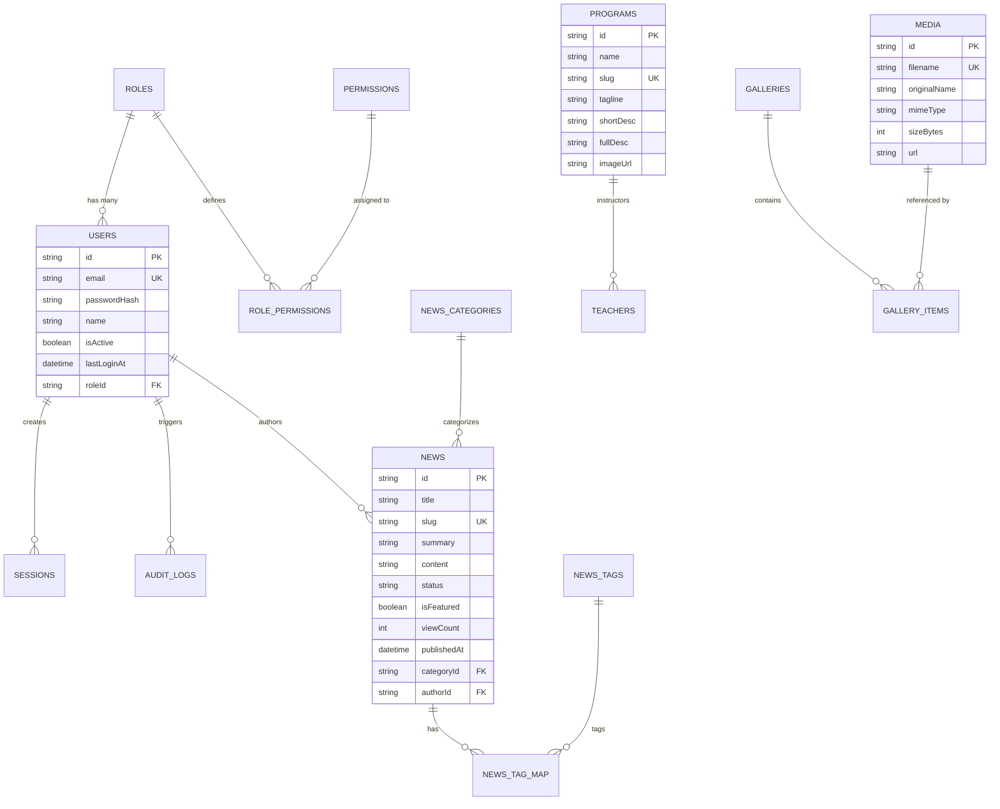

# Arsitektur Basis Data (Database Architecture & Schema)

## Website Profil Resmi & CMS SMKN 1 Pakuan Ratu

Dokumen ini mendokumentasikan skema relasional, indeks, kendala (*foreign keys*), dan relasi antartabel pada basis data MySQL 8 yang dikelola oleh Prisma ORM.

---

## 1. Diagram Relasi Entitas (Entity-Relationship Diagram)

---

## 2. Rincian 16 Model Relasional

### 1. `roles`, `permissions`, `role_permissions`
- **Tujuan**: Mendasari sistem Role-Based Access Control (RBAC).
- **Peran Bawaan**: `SUPER_ADMIN`, `ADMIN` (Humas), `STAFF`.

### 2. `users` & `sessions`
- **Tujuan**: Autentikasi pengelola CMS.
- **Fitur Kunci**: Password hashing Argon2id, tracking sesi peramban, waktu login terakhir, status aktifasi, relasi ke role.

### 3. `audit_logs`
- **Tujuan**: Jejak audit sistem untuk kepatuhan tata kelola (*compliance*).
- **Kolom Kunci**: `action`, `resource`, `details`, `ipAddress`, `userAgent`, `userId`.

### 4. `settings`
- **Tujuan**: Konfigurasi nilai kunci (*key-value*) global sekolah tanpa *hardcoding*.
- **Contoh Kunci**: `school_name`, `school_address`, `school_phone`, `school_email`, `social_instagram`.

### 5. `media`
- **Tujuan**: Pustaka penyimpanan foto dan berkas sekolah teroptimasi WebP.
- **Kolom Kunci**: `filename`, `mimeType`, `sizeBytes`, `width`, `height`, `url`.

### 6. `news`, `news_categories`, `news_tags`, `news_tag_map`
- **Tujuan**: Manajemen artikel berita dan warta kegiatan sekolah.
- **Fitur Kunci**: Workflow status (`DRAFT`, `REVIEW`, `PUBLISHED`, `ARCHIVED`), slug unik, indeks pencarian, optimasi SEO (`metaTitle`, `metaDesc`).

### 7. `announcements`
- **Tujuan**: Publikasi edaran dinas dan pengumuman sekolah.
- **Fitur Kunci**: Penanda `isUrgent`, status `isActive`, lampiran dokumen.

### 8. `events`
- **Tujuan**: Kalender pendidikan dan agenda kegiatan.
- **Fitur Kunci**: Waktu mulai & selesai, lokasi, status (`UPCOMING`, `ONGOING`, `COMPLETED`, `CANCELLED`).

### 9. `programs`
- **Tujuan**: Informasi 5 jurusan kejuruan unggulan SMKN 1 Pakuan Ratu.
- **Data Jurusan**: Agribisnis Tanaman, Agribisnis Ternak, Akuntansi & Bisnis Digital, Desain Komunikasi Visual, Teknik & Bisnis Sepeda Motor.

### 10. `teachers`
- **Tujuan**: Direktori tenaga pendidik dan kependidikan (TU).
- **Kolom Kunci**: `name`, `nip`, `position`, `subject`, `photoUrl`, `isStaff`.

### 11. `facilities`
- **Tujuan**: Sarana prasarana sekolah.
- **Kategori**: `Lab & Bengkel`, `Ruang Belajar`, `Olahraga`, `Penunjang`.

### 12. `achievements`
- **Tujuan**: Rekam jejak medali dan penghargaan peserta didik.
- **Kolom Kunci**: `studentName`, `competition`, `level` (Kabupaten/Provinsi/Nasional), `year`, `category`.

### 13. `galleries` & `gallery_items`
- **Tujuan**: Album dokumentasi visual kegiatan dan praktikum siswa.
- **Fitur Kunci**: Berelasi many-to-one ke tabel `media` dan mendukung urutan tampilan (*displayOrder*).

### 14. `pages`
- **Tujuan**: Konten dinamis untuk 4 halaman profil utama (Sejarah, Visi Misi, Sambutan Kepala Sekolah, Struktur Organisasi).

### 15. `homepage_sections`
- **Tujuan**: Mengatur judul headline, teks tombol CTA, dan konten visual beranda tanpa kompilasi ulang kode sumber.

### 16. `contact_messages`
- **Tujuan**: Kotak penampung pesan aspirasi dan pertanyaan dari pengunjung website dengan penanda status `isRead`.

---

## 3. Strategi Pengindeksan (Indexing Strategy)

Untuk memastikan performa kueri tetap cepat bahkan dengan puluhan ribu rekaman data:
1. **Index Unik (`@unique`)**: Digunakan pada `users.email`, `news.slug`, `programs.slug`, `pages.slug`, `galleries.slug`, `media.filename`, `settings.key`.
2. **Index Komposit & Filter (`@@index`)**:
   - `news(status, publishedAt)`: Mempercepat kueri beranda yang mencari artikel terbit terbaru.
   - `events(status, startDate)`: Mempercepat pencarian agenda mendatang.
   - `achievements(year, level)`: Mempercepat filter riwayat kejuaraan.
   - `audit_logs(createdAt, action)`: Mempercepat pelaporan aktivitas sistem.
