# PROPOSAL TUGAS AKHIR

# PENGEMBANGAN WEBSITE PROFIL DAN CONTENT MANAGEMENT SYSTEM (CMS) SMKN 1 PAKUAN RATU BERBASIS REACT DAN EXPRESS SEBAGAI MEDIA INFORMASI, PUBLIKASI, DAN DIGITALISASI IDENTITAS SEKOLAH

---

## HALAMAN JUDUL (KULIT LUAR)

```text
PENGEMBANGAN WEBSITE PROFIL DAN CONTENT MANAGEMENT SYSTEM (CMS) 
SMKN 1 PAKUAN RATU BERBASIS REACT DAN EXPRESS SEBAGAI MEDIA INFORMASI, 
PUBLIKASI, DAN DIGITALISASI IDENTITAS SEKOLAH

(Proposal Tugas Akhir Mahasiswa)

Oleh:
[NAMA MAHASISWA]
NPM. [NOMOR POKOK MAHASISWA]

JURUSAN EKONOMI DAN BISNIS
POLITEKNIK NEGERI LAMPUNG
BANDAR LAMPUNG
2026
```

---

## HALAMAN JUDUL (KULIT DALAM)

```text
PENGEMBANGAN WEBSITE PROFIL DAN CONTENT MANAGEMENT SYSTEM (CMS) 
SMKN 1 PAKUAN RATU BERBASIS REACT DAN EXPRESS SEBAGAI MEDIA INFORMASI, 
PUBLIKASI, DAN DIGITALISASI IDENTITAS SEKOLAH

Oleh:
[NAMA MAHASISWA]
NPM. [NOMOR POKOK MAHASISWA]

Proposal Tugas Akhir Mahasiswa
Sebagai Salah Satu Syarat untuk Melaksanakan Penelitian Tugas Akhir
pada Program Studi Rekayasa Perangkat Lunak Terapan / Manajemen Informatika
Jurusan Ekonomi dan Bisnis

POLITEKNIK NEGERI LAMPUNG
BANDAR LAMPUNG
2026
```

---

## HALAMAN PENGESAHAN

**HALAMAN PENGESAHAN**

1. **Judul Tugas Akhir Mahasiswa**: Pengembangan Website Profil dan Content Management System (CMS) SMKN 1 Pakuan Ratu Berbasis React dan Express sebagai Media Informasi, Publikasi, dan Digitalisasi Identitas Sekolah
2. **Nama Mahasiswa**: [NAMA MAHASISWA]
3. **Nomor Pokok Mahasiswa**: [NPM MAHASISWA]
4. **Program Studi**: Rekayasa Perangkat Lunak Terapan / Manajemen Informatika
5. **Jurusan**: Ekonomi dan Bisnis

Bandar Lampung, [Tanggal, Bulan] 2026

Menyetujui,

**Dosen Pembimbing I**  
[Nama Dosen Pembimbing I, Gelar]  
NIP. [NIP Dosen Pembimbing I]

**Dosen Pembimbing II**  
[Nama Dosen Pembimbing II, Gelar]  
NIP. [NIP Dosen Pembimbing II]

Mengetahui,  
**Ketua Jurusan Ekonomi dan Bisnis**  
Politeknik Negeri Lampung  

[Nama Ketua Jurusan, Gelar]  
NIP. [NIP Ketua Jurusan]  

Tanggal Seminar Proposal: ........................................

---

## KATA PENGANTAR

Puji dan syukur penulis panjatkan ke hadirat Allah SWT atas limpahan rahmat, hidayah, dan karunia-Nya, sehingga proposal tugas akhir yang berjudul **"Pengembangan Website Profil dan Content Management System (CMS) SMKN 1 Pakuan Ratu Berbasis React dan Express sebagai Media Informasi, Publikasi, dan Digitalisasi Identitas Sekolah"** ini dapat diselesaikan dengan baik. 

Penyusunan proposal ini dimaksudkan sebagai salah satu syarat akademis dalam menyelesaikan kurikulum pendidikan vokasi jenjang Diploma pada Jurusan Ekonomi dan Bisnis, Politeknik Negeri Lampung. Proposal ini merumuskan rancangan sistem digital komprehensif yang memadukan portal profil sekolah interaktif berdesain *modern editorial* dengan sistem pengelolaan konten terintegrasi (*Content Management System* / CMS) yang aman, efisien, dan mandiri guna mendukung transformasi digital di SMKN 1 Pakuan Ratu, Kabupaten Way Kanan.

Keberhasilan penyusunan proposal tugas akhir ini tidak terlepas dari bimbingan, arahan, dan dukungan moril dari berbagai pihak. Oleh karena itu, dengan ketulusan hati penulis menyampaikan ucapan terima kasih yang sebesar-besarnya kepada:
1. Direktur Politeknik Negeri Lampung, beserta jajaran pimpinan yang telah memfasilitasi sarana dan prasarana pendidikan.
2. Ketua Jurusan Ekonomi dan Bisnis Politeknik Negeri Lampung, yang selalu memberikan bimbingan dan dorongan akademis.
3. Ketua Program Studi, atas arahan kurikulum dan tata kelola pelaksanaan tugas akhir.
4. Dosen Pembimbing I dan Dosen Pembimbing II, yang senantiasa meluangkan waktu, memberikan kritik, koreksi mendalam, dan membimbing penulis sejak inisiasi gagasan hingga tersusunnya rancangan penelitian ini.
5. Kepala SMK Negeri 1 Pakuan Ratu, beserta jajaran dewan guru dan staf kependidikan yang telah memberikan keterbukaan informasi, data faktual, serta kerja sama yang konstruktif selama studi pendahuluan.
6. Orang tua dan seluruh keluarga tercinta, atas doa yang tiada putus, pengorbanan, dan dukungan material maupun spiritual.
7. Rekan-rekan mahasiswa seperjuangan, yang saling memberikan motivasi, inspirasi, dan diskusi teknis yang bermanfaat.

Penulis menyadari bahwa naskah proposal ini masih memiliki keterbatasan. Oleh karenanya, kritik dan saran yang bersifat membangun sangat diharapkan guna menyempurnakan penelitian ini. Semoga proposal ini dapat memberikan kontribusi nyata bagi kemajuan teknologi informasi pada institusi pendidikan vokasi dan masyarakat luas.

Bandar Lampung, [Bulan] 2026  
Penulis,  

[NAMA MAHASISWA]

---

## DAFTAR ISI

```text
HALAMAN JUDUL (KULIT LUAR) ................................................... i
HALAMAN JUDUL (KULIT DALAM) ................................................. ii
HALAMAN PENGESAHAN .......................................................... iii
KATA PENGANTAR ............................................................. iv
DAFTAR ISI .................................................................. v
DAFTAR TABEL ................................................................ vi
DAFTAR GAMBAR ............................................................... vii

I. PENDAHULUAN .............................................................. 1
   1.1 Latar Belakang ....................................................... 1
   1.2 Perumusan Masalah .................................................... 4
   1.3 Tujuan Penelitian .................................................... 4
   1.4 Kerangka Pemikiran ................................................... 5
   1.5 Batasan Masalah ...................................................... 7
   1.6 Kontribusi Penelitian ................................................ 8

II. TINJAUAN PUSTAKA ........................................................ 10
    2.1 Website Profil Sekolah dan Transformasi Digital Vokasi .............. 10
    2.2 Content Management System (CMS) dan Alur Kerja Publikasi ............ 11
    2.3 Role-Based Access Control (RBAC) dan Keamanan Aplikasi .............. 12
    2.4 Desain Antarmuka Glassmorphism dan Pengalaman Pengguna .............. 14
    2.5 Tinjauan Teknologi Pengembangan Sistem .............................. 16
        2.5.1 React 19 dan TypeScript ....................................... 16
        2.5.2 Bundler Vite 6 ................................................ 17
        2.5.3 Tailwind CSS .................................................. 18
        2.5.4 Node.js dan Express Framework ................................. 18
        2.5.5 Prisma ORM dan MySQL 8 ........................................ 19
        2.5.6 Pemrosesan Citra Digital Sharp Engine ......................... 20
        2.5.7 Manajemen Status (TanStack Query dan Zustand) ................. 21
        2.5.8 Kriptografi Argon2id dan JSON Web Token ....................... 22
    2.6 Metode Pengujian Sistem ............................................. 23
        2.6.1 Black Box Testing ............................................. 23
        2.6.2 System Usability Scale (SUS) .................................. 24

III. METODE PELAKSANAAN ..................................................... 25
     3.1 Tempat dan Waktu Pelaksanaan ....................................... 25
     3.2 Bahan dan Alat ..................................................... 25
         3.2.1 Perangkat Keras (Hardware) ................................... 25
         3.2.2 Perangkat Lunak (Software) ................................... 26
     3.3 Rancangan Penelitian dan Model Pengembangan Sistem ................. 27
         3.3.1 Tahap Analisis Kebutuhan (Requirements) ...................... 28
         3.3.2 Tahap Perancangan Sistem dan Basis Data (Design) ............. 29
         3.3.3 Tahap Implementasi Kode Program (Implementation) ............. 30
         3.3.4 Tahap Pengujian Sistem (Verification / Testing) ............... 31
         3.3.5 Tahap Penerapan dan Pemeliharaan (Deployment) ................ 32
     3.4 Prosedur Pelaksanaan Proyek ........................................ 32
     3.5 Parameter Pengamatan dan Pengujian ................................. 34
         3.5.1 Pengujian Fungsionalitas (Black Box) ......................... 34
         3.5.2 Pengujian Keamanan Siber (Security Assessment) ............... 36
         3.5.3 Pengujian Kinerja dan Aksesibilitas (Lighthouse) .............. 37
         3.5.4 Pengujian Penerimaan Pengguna (Usability Testing) ............ 38
     3.6 Jadwal Pelaksanaan Penelitian ...................................... 39
     3.7 Personalia Pelaksana Proyek ........................................ 40

IV. RENCANA ANGGARAN BIAYA PENELITIAN ....................................... 41
    4.1 Rekapitulasi Rencana Anggaran Biaya ................................. 41
    4.2 Rincian Alokasi Biaya ............................................... 41

DAFTAR PUSTAKA .............................................................. 44

LAMPIRAN .................................................................... 48
Lampiran 1. Diagram Alir Arsitektur dan Entity-Relationship Diagram (ERD) ... 49
Lampiran 2. Spesifikasi Endpoint REST API Sistem ............................ 52
Lampiran 3. Rancangan Antarmuka Pengguna (UI Wireframe) ..................... 55
Lampiran 4. Matriks Peran dan Hak Akses (RBAC Matrix) ....................... 57
```

---

## DAFTAR TABEL

```text
Tabel 1. Matriks Hak Akses Pengguna (Role-Based Access Control) ............. 13
Tabel 2. Spesifikasi Perangkat Keras Pengembangan dan Server ................ 26
Tabel 3. Spesifikasi Perangkat Lunak Sistem ................................. 26
Tabel 4. Rencana Kasus Uji Pengujian Fungsional (Black Box Testing) ......... 35
Tabel 5. Matriks Parameter Evaluasi Keamanan Web (Security Checklist) ....... 37
Tabel 6. Jadwal Rencana Pelaksanaan Proyek (Gantt Chart 6 Bulan) ............ 39
Tabel 7. Susunan Personalia Tim Pelaksana Proyek ............................ 40
Tabel 8. Rekapitulasi Rencana Anggaran Biaya Proyek ......................... 41
Tabel 9. Rincian Anggaran Pembelian Perangkat Keras dan Lisensi ............. 42
Tabel 10. Rincian Anggaran Operasional Riset dan Pengumpulan Data ........... 42
Tabel 11. Rincian Anggaran Domain, Hosting VPS, dan Keamanan Cloud .......... 43
Tabel 12. Rincian Anggaran Seminar, Uji Publik, dan Pelaporan ............... 43
```

---

## DAFTAR GAMBAR

```text
Gambar 1. Kerangka Pemikiran Pengembangan Sistem ............................ 6
Gambar 2. Diagram Alir Arsitektur Sistem Terintegrasi (High-Level Design) ... 15
Gambar 3. Diagram Alur Pengembangan Sistem Waterfall Model .................. 28
Gambar 4. Diagram Use Case Modul Publik dan CMS Pengelola .................. 30
Gambar 5. Diagram Hubungan Antarentitas Basis Data (ERD 16 Model) ............ 51
Gambar 6. Desain Visual Antarmuka Beranda Portal Publik ..................... 55
Gambar 7. Desain Antarmuka Panel Kontrol CMS Admin .......................... 56
```

---

# BAB I. PENDAHULUAN

## 1.1 Latar Belakang

Perkembangan teknologi informasi dan komunikasi di era Revolusi Industri 4.0 dan Society 5.0 telah mentransformasi paradigma penyampaian informasi di berbagai sektor, termasuk pendidikan kejuruan (*vocational education*). Institusi pendidikan dituntut untuk memiliki saluran komunikasi digital yang representatif, dinamis, cepat diakses, dan memiliki kredibilitas tinggi. Keberadaan situs web resmi (*official school website*) bukan lagi sekadar pelengkap administratif, melainkan telah menjadi representasi digital resmi (*digital storefront*) dan jendela utama yang menghubungkan sekolah dengan calon peserta didik, wali murid, dunia usaha dan dunia industri (DUDI), dinas pendidikan, serta masyarakat umum.

Sekolah Menengah Kejuruan Negeri (SMKN) 1 Pakuan Ratu, yang berlokasi di Kecamatan Pakuan Ratu, Kabupaten Way Kanan, Provinsi Lampung, merupakan institusi pendidikan vokasi yang memiliki peran strategis dalam menyiapkan tenaga kerja terampil dan wirausahawan muda. Karakteristik keunggulan SMKN 1 Pakuan Ratu tercermin dari keberagaman 5 (lima) program keahlian yang diselenggarakan, yaitu:
1. **Agribisnis Tanaman (Pertanian)**, yang berfokus pada teknik budidaya modern, pertanian presisi (*smart farming*), dan hortikultura berkelanjutan.
2. **Agribisnis Ternak (Peternakan)**, yang mendalami manajemen pemeliharaan ternak ruminansia dan unggas, bioteknologi pakan, serta agribisnis peternakan.
3. **Akuntansi dan Bisnis Digital**, yang membekali peserta didik dengan kompetensi pembukuan terkomputerisasi, perpajakan, *financial technology* (fintech), dan *e-commerce*.
4. **Desain Komunikasi Visual (DKV)**, yang mengasah kreativitas visual dalam desain grafis, ilustrasi digital, multimedia interaktif, UI/UX, dan produksi konten periklanan.
5. **Teknik dan Bisnis Sepeda Motor (TBSM)**, yang memadukan keahlian teknik mekanik kendaraan roda dua, diagnostik sistem injeksi elektronik (*electronic fuel injection* / EFI), dan pengelolaan bengkel mandiri.

Keberagaman potensi vokasi ini memerlukan media representasi digital yang mampu mengartikulasikan keunggulan setiap jurusan secara visual, naratif, dan terstruktur. Nilai-nilai kearifan lokal agrikultur yang berpadu dengan modernisasi teknologi kejuruan melahirkan konsep identitas: *"Berakar pada potensi, tumbuh menuju masa depan"*. Konsep ini menggabungkan tema natural agrikultur, ketepatan bisnis, ekspresi kreatif, dan keterampilan teknis dalam sebuah ekosistem visual modern.

Berdasarkan hasil observasi dan wawancara awal dengan pihak pengelola di SMKN 1 Pakuan Ratu, ditemukan sejumlah kendala mendasar pada tata kelola media informasi sekolah saat ini:
1. **Ketergantungan terhadap Pengembang Eksternal**: Informasi yang dikelola pada media daring konvensional bersifat statis. Setiap perubahan data, seperti pembaharuan agenda kegiatan, berita prestasi peserta didik, pengumuman seleksi penerimaan murid baru, maupun perubahan profil dewan guru, membutuhkan perubahan langsung pada kode program (*hardcoded source code*). Kondisi ini menyebabkan waktu tunggu yang lama, biaya pemeliharaan tambahan, serta ketidakefisienan operasional karena staf internal sekolah tidak memiliki kendali mandiri.
2. **Ketiadaan Sistem Pengelolaan Konten (CMS) Berjenjang**: Sekolah belum memiliki panel administratif terintegrasi yang menyediakan pemisahan wewenang (*Role-Based Access Control* / RBAC). Ketiadaan CMS menyebabkan staf hubungan masyarakat (Humas) dan staf operasional kesulitan menerbitkan artikel dan warta secara terjadwal dengan alur verifikasi draf yang baku.
3. **Pengelolaan Aset Digital dan Dokumentasi yang Kurang Terstandar**: Dokumentasi foto kegiatan praktikum dan bengkel diunggah tanpa optimasi kompresi citra. Berkas citra mentah berukuran besar menyebabkan penurunan performa waktu muat (*page load time*) yang signifikan pada koneksi internet seluler di daerah. Di samping itu, metadata sensitif seperti data koordinat lokasi (EXIF GPS) dari ponsel tidak dibersihkan, yang berpotensi menimbulkan risiko privasi.
4. **Pengalaman Pengguna (UI/UX) yang Ketinggalan Zaman**: Mayoritas situs web sekolah daerah masih mengadopsi tampilan kaku, tidak responsif terhadap peramban telepon pintar, serta sering kali menggunakan kotak dialog bawaan peramban seperti `alert()` JavaScript yang mengganggu kenyamanan interaksi pengguna dan tampak tidak profesional.
5. **Kerentanan Keamanan Siber**: Situs web institusi pendidikan rentan menjadi target serangan siber, seperti *brute-force login*, injeksi SQL (*SQL Injection*), perusakan tampilan (*web defacement*), serangan skrip lintas situs (*Cross-Site Scripting* / XSS), dan unggahan berkas berbahaya (*malicious file upload*).

Untuk mengatasi kendala-kendala di atas, diperlukan pengembangan sistem terintegrasi yang memisahkan arsitektur penyajian publik (*frontend*) dan logika bisnis serta penyimpanan data (*backend*). Sistem ini mengintegrasikan portal profil publik berestetika tinggi dengan *Content Management System* (CMS) yang dirancang khusus untuk memfasilitasi kebutuhan administrasi SMKN 1 Pakuan Ratu.

Penerapan tumpukan teknologi modern berbasis **React 19**, **Vite 6**, dan **Tailwind CSS** dengan pendekatan gaya visual *Glassmorphism* semi-transparan (`bg-white/40`, `backdrop-blur-md`, `border-white/40`, `shadow-sm`) memberikan tampilan yang elegan, profesional, dan responsif. Penggantian seluruh fungsi dialog native peramban dengan komponen antarmuka mandiri (*Custom Toast Notification* dan *Modal Component UI*) menciptakan interaksi yang mulus dan interaktif. 

Pada lapisan server, penerapan **Node.js**, **Express Framework**, **TypeScript**, serta **Prisma ORM** yang terhubung ke basis data relasional **MySQL 8** memberikan keandalan logika bisnis berorientasi layanan (*service-oriented*). Sistem keamanan dirancang dengan paradigma pertahanan berlapis (*defense in depth*), memanfaatkan enkripsi sandi algoritma **Argon2id**, sesi berbasis *HttpOnly cookie* aman, pembatasan laju permintaan (*rate limiting*), sanitasi HTML (*Stored XSS prevention*), serta kompresi citra otomatis ke format mutakhir **WebP** dengan pembersihan metadata EXIF melalui mesin pemrosesan citra **Sharp**.

Pengembangan sistem ini sejalan dengan kompetensi keahlian pada kurikulum Politeknik Negeri Lampung dalam menghasilkan solusi rekayasa perangkat lunak terapan yang aplikatif, aman, dan berdaya guna bagi mitra institusi pendidikan vokasi di Provinsi Lampung.

---

## 1.2 Perumusan Masalah

Berdasarkan latar belakang yang telah diuraikan, perumusan masalah dalam proyek tugas akhir ini adalah sebagai berikut:
1. Bagaimana merancang dan membangun website profil publik SMKN 1 Pakuan Ratu yang interaktif, responsif, dan mencerminkan identitas 5 program keahlian vokasi dengan pendekatan estetika modern editorial dan *Glassmorphism*?
2. Bagaimana merancang dan mengimplementasikan *Content Management System* (CMS) terintegrasi berbasis *Role-Based Access Control* (RBAC) yang memungkinkan staf sekolah non-teknis mengelola konten, warta, agenda, prestasi, galeri, dan konfigurasi profil secara mandiri tanpa modifikasi kode sumber?
3. Bagaimana mengintegrasikan pustaka media (*Media Library*) terotomasi menggunakan pustaka pemrosesan citra *Sharp* untuk konversi ke format WebP dan penghapusan metadata EXIF guna meningkatkan efisiensi penyimpanan dan kecepatan akses?
4. Bagaimana menerapkan arsitektur keamanan bertingkat (*defense in depth*) mencakup proteksi *brute-force*, *rate limiting*, *HttpOnly cookie*, *hashing* sandi Argon2id, pencegahan injeksi SQL, dan sanitasi XSS pada platform SMKN 1 Pakuan Ratu?
5. Bagaimana menguji fungsionalitas, keamanan, dan kegunaan (*usability*) sistem menggunakan metode *Black Box Testing* dan *System Usability Scale* (SUS) untuk memastikan kelayakan penerapan sistem di lingkungan SMKN 1 Pakuan Ratu?

---

## 1.3 Tujuan Penelitian

### 1.3.1 Tujuan Umum
Mengembangkan sistem website profil digital dan *Content Management System* (CMS) SMKN 1 Pakuan Ratu sebagai media informasi resmi, publikasi prestasi, dan digitalisasi identitas sekolah yang modern, aman, responsif, serta dapat dikelola secara mandiri oleh pihak sekolah.

### 1.3.2 Tujuan Khusus
1. Menganalisis kebutuhan informasi publik dan alur kerja operasional administrasi konten pada SMKN 1 Pakuan Ratu.
2. Merancang antarmuka pengguna (*User Interface* / UI) dan pengalaman pengguna (*User Experience* / UX) website profil dengan konsep editorial modern beraksen *Glassmorphism* (`bg-white/40`, `backdrop-blur-md`, `border-white/40`, `shadow-sm`) yang responsif pada resolusi desktop, tablet, dan ponsel pintar.
3. Mengeliminasi seluruh fungsi `alert()` native JavaScript dan menggantikannya dengan sistem umpan balik visual (*Custom Toast Notification* dan *Modal Dialog*) yang konsisten dan informatif.
4. Membangun modul publik yang mencakup beranda dinamis, profil sekolah (Sejarah, Visi Misi, Sambutan Kepala Sekolah, Struktur Organisasi), showcase 5 program keahlian, direktori tenaga pendidik, katalog fasilitas, warta berita, agenda kalender pendidikan, pengumuman resmi, direktori prestasi, galeri foto terstruktur, dan formulir kontak aspirasi.
5. Membangun modul panel administrasi CMS berbasis pembagian peran (*Super Admin*, *Admin/Humas*, dan *Staf*) dengan proteksi invarian pencegahan penghapusan akun administrator utama terakhir.
6. Membangun pipa pengelolaan media teroptimasi yang secara otomatis mengompresi gambar ke ekstensi WebP dan membersihkan informasi EXIF guna menghemat lebar pita (*bandwidth*) dan menjaga privasi data.
7. Menerapkan arsitektur basis data relasional 16 entitas menggunakan Prisma ORM dan MySQL 8 dengan indeks komposit teroptimasi.
8. Menerapkan pengamanan data dan sesi peramban menggunakan Argon2id, JWT bertanda tangan digital, sanitasi HTML masukan, dan pembatasan laju permintaan (*rate limiting*).
9. Melakukan pengujian fungsionalitas menggunakan pengujian unit otomatis Vitest dan *Black Box Testing*, serta evaluasi tingkat kepuasan pengguna menggunakan kuesioner *System Usability Scale* (SUS).

---

## 1.4 Kerangka Pemikiran

Kerangka pemikiran dalam pengembangan sistem ini disusun secara sistematis untuk menjembatani kesenjangan antara permasalahan nyata di sekolah dengan solusi rekayasa teknologi informasi yang diterapkan. Diagram kerangka pemikiran disajikan pada Gambar 1.

```text
+-----------------------------------------------------------------------------------+
|                                   MASALAH (INPUT)                                 |
| 1. Ketiadaan portal digital resmi SMKN 1 Pakuan Ratu yang terstruktur.           |
| 2. Ketergantungan pembaruan konten pada perubahan kode program programmer.        |
| 3. Aset dokumentasi foto berukuran besar tanpa kompresi dan mengandung EXIF.      |
| 4. Antarmuka konvensional yang kaku dan minim responsivitas mobile.               |
| 5. Kerentanan keamanan terhadap brute-force, SQL injection, XSS, dan data leak.   |
+-----------------------------------------------------------------------------------+
                                          |
                                          v
+-----------------------------------------------------------------------------------+
|                             PENDEKATAN & METODOLOGI (PROCESS)                     |
| 1. Model Rekayasa Perangkat Lunak: Classical Waterfall (Pressman).                |
| 2. Riset Kebutuhan: Wawancara mendalam, observasi institusi, studi literatur.      |
| 3. Desain Arsitektur: Clean Architecture, Separation of Concerns, Defense-in-Depth|
| 4. Desain Antarmuka: Glassmorphism (`bg-white/40 backdrop-blur-md border-white/40`)|
| 5. Tumpukan Teknologi:                                                            |
|    - Frontend: React 19, Vite 6, TypeScript, Tailwind CSS 3, Zustand, TanStack Q.  |
|    - Backend : Node.js, Express, TypeScript, Prisma ORM, MySQL 8, Sharp Engine.   |
|    - Keamanan: Argon2id, JWT via HttpOnly Cookies, Sanitize-HTML, RateLimiter.   |
| 6. Evaluasi & Pengujian: Vitest Unit Testing, Black Box Testing, SUS Usability.  |
+-----------------------------------------------------------------------------------+
                                          |
                                          v
+-----------------------------------------------------------------------------------+
|                                     HASIL (OUTPUT)                                |
| 1. Website Profil Sekolah SMKN 1 Pakuan Ratu yang interaktif dan responsif.       |
| 2. Panel CMS Mandiri dengan Role-Based Access Control (Super Admin, Humas, Staf). |
| 3. Pipeline Optimasi Media Otomatis (WebP + Stripping EXIF).                      |
| 4. Sistem Umpan Balik Visual Elegan (Custom Toast Notification & Modal UI).       |
| 5. Sistem Keamanan Aplikasi Web Teruji dan Audit Log Aktivitas Pengguna.          |
+-----------------------------------------------------------------------------------+
                                          |
                                          v
+-----------------------------------------------------------------------------------+
|                                    DAMPAK (OUTCOME)                               |
| 1. Efisiensi tata kelola informasi sekolah tanpa ketergantungan programmer.       |
| 2. Peningkatan citra kelembagaan (*branding*) dan kredibilitas SMKN 1 Pakuan Ratu|
| 3. Kemudahan akses informasi bagi calon siswa, wali murid, dan mitra industri.    |
| 4. Terwujudnya ekosistem digital sekolah vokasi yang aman dan berkelanjutan.     |
+-----------------------------------------------------------------------------------+
```
**Gambar 1. Kerangka Pemikiran Pengembangan Sistem**

---

## 1.5 Batasan Masalah

Agar ruang lingkup penelitian dan pengembangan sistem terfokus dan tidak menyimpang dari tujuan utama, ditetapkan batasan-batasan masalah sebagai berikut:
1. **Objek Penelitian**: Sistem dikembangkan khusus untuk melayani kebutuhan informasi dan publikasi SMKN 1 Pakuan Ratu, Kabupaten Way Kanan, Provinsi Lampung.
2. **Program Keahlian**: Informasi kurikulum dan kegiatan difokuskan pada 5 program keahlian yang aktif diselenggarakan di sekolah (Agribisnis Tanaman, Agribisnis Ternak, Akuntansi dan Bisnis Digital, Desain Komunikasi Visual, serta Teknik dan Bisnis Sepeda Motor).
3. **Ruang Lingkup Modul Publik**: Meliputi halaman beranda interaktif, profil institusi (sejarah, visi-misi, sambutan kepala sekolah, struktur organisasi), direktori kejuruan, warta berita, agenda kalender pendidikan, pengumuman sekolah, riwayat prestasi siswa, direktori guru dan tenaga kependidikan, katalog sarana prasarana, album galeri kegiatan, serta formulir kontak pengaduan/aspirasi.
4. **Ruang Lingkup CMS**: Menyediakan fasilitas pengelolaan konten dinamis (*Create, Read, Update, Delete* / CRUD) untuk artikel berita, kategori dan tag, agenda, pengumuman, data prestasi, galeri media, direktori guru, fasilitas, profil sekolah statis, teks beranda, serta pembacaan kotak masuk pesan aspirasi.
5. **Hak Akses Pengguna (RBAC)**: Pembagian kewenangan dibatasi pada 3 (tiga) tingkat peran:
   - *Super Admin*: Penguasaan penuh sistem, manajemen akun pengguna, peninjauan *audit trail*, dan konfigurasi global identitas sekolah.
   - *Admin / Humas*: Pengelolaan operasional konten publikasi, agenda, warta, prestasi, dan media galeri.
   - *Staf*: Penyusunan draf warta berita dan pengunggahan berkas media dokumentasi.
6. **Pemrosesan Berkas Media**: Dibatasi pada berkas citra berformat JPEG, PNG, dan WebP dengan ukuran maksimal 10 MB per berkas. Sistem akan mengonversi citra secara otomatis ke WebP serta membersihkan metadata EXIF.
7. **Pengujian Sistem**: Evaluasi pengujian sistem dibatasi pada *Unit Testing* logika bisnis menggunakan Vitest, *Black Box Testing* fungsionalitas, evaluasi kepatuhan keamanan web dasar (OWASP Top 10 mitigations), serta pengujian kegunaan (*usability testing*) menggunakan instrumen kuesioner *System Usability Scale* (SUS) kepada perwakilan staf sekolah dan pengunjung.

---

## 1.6 Kontribusi Penelitian

Hasil dari penelitian dan pengembangan sistem tugas akhir ini diharapkan memberikan kontribusi dan manfaat nyata, baik secara teoritis maupun praktis:

### 1.6.1 Kontribusi Praktis
1. **Bagi SMKN 1 Pakuan Ratu**:
   - Memberikan platform digital resmi berdaya guna tinggi yang meningkatkan citra (*branding*) institusi di tingkat daerah maupun nasional.
   - Mengeliminasi ketergantungan staf sekolah terhadap bantuan pihak ketiga dalam mempublikasikan berita, prestasi, pengumuman dinas, dan dokumentasi sekolah.
   - Mengoptimalkan efisiensi alur kerja staf humas dan tata usaha melalui sistem manajemen konten yang intuitif dan terintegrasi.
2. **Bagi Calon Peserta Didik dan Masyarakat**:
   - Memberikan saluran informasi yang valid, transparan, dan mudah diakses mengenai profil keunggulan jurusan, sarana praktikum, prestasi, dan kalender kegiatan sekolah.
   - Mempermudah penyampaian pertanyaan atau aspirasi secara langsung melalui formulir kontak digital yang terproteksi.
3. **Bagi Tenaga Pendidik dan Siswa**:
   - Menyediakan wadah apresiasi publik atas karya dan raihan prestasi kejuaraan siswa di berbagai bidang keahlian vokasi.

### 1.6.2 Kontribusi Akademis dan Keilmuan
1. **Bagi Politeknik Negeri Lampung**:
   - Menjadi rujukan implementasi rekayasa perangkat lunak terapan berskala institusi yang menggabungkan arsitektur *Clean Architecture*, *Single Page Application* (SPA) modern, dan pendekatan estetika *Glassmorphism*.
   - Menambah khazanah karya ilmiah mahasiswa di bidang Rekayasa Perangkat Lunak dan Sistem Informasi Terapan yang dapat diakses oleh sivitas akademika.
2. **Bagi Pengembang Perangkat Lunak Lain**:
   - Menyajikan pola perancangan teruji (*best practice*) dalam penerapan arsitektur *Defense in Depth*, integrasi kompresi citra nir-kehilangan (*lossless*) menggunakan pustaka Sharp, serta otomasi *audit trail* aktivitas pada platform CMS berbasis TypeScript *full-stack*.

---

# BAB II. TINJAUAN PUSTAKA

## 2.1 Website Profil Sekolah dan Transformasi Digital Vokasi

Situs web profil institusi (*institutional profile website*) adalah serangkaian halaman digital yang terhubung dalam satu nama domain resmi di jaringan internet, bertujuan untuk merepresentasikan identitas, visi, misi, rekam jejak, dan kapabilitas sebuah organisasi kepada khalayak sasaran (Pressman & Maxim, 2020). Dalam konteks pendidikan kejuruan (SMK), situs web profil mengemban fungsi yang jauh melampaui papan pengumuman konvensional. Pendidikan vokasi yang berorientasi pada kesiapan kerja menuntut adanya media komunikasi yang mampu memvisualisasikan fasilitas laboratorium, bengkel kejuruan, kompetensi kurikulum, kerja sama industri, serta portofolio karya peserta didik secara interaktif (Kurniawan & Syahputra, 2021).

Keberhasilan sebuah situs web profil sekolah sangat dipengaruhi oleh kecepatan penemuan informasi (*information findability*), kejelasan hierarki navigasi, keakuratan data, dan kenyamanan visual. Dengan menyajikan informasi yang terstruktur secara berkala, sekolah mampu membangun kredibilitas publik (*public trust*) serta menarik minat calon peserta didik berkualitas.

## 2.2 Content Management System (CMS) dan Alur Kerja Publikasi

*Content Management System* (CMS) adalah aplikasi perangkat lunak yang memungkinkan pengguna dengan berbagai tingkat keahlian teknis untuk membuat, mengedit, mengorganisasi, dan mempublikasikan konten digital di situs web secara kolaboratif tanpa memerlukan manipulasi langsung pada bahasa markup HTML atau basis data (Sommerville, 2016).

Pada arsitektur CMS modern terintegrasi, pembaruan konten diatur melalui siklus alur kerja (*workflow*) yang sistematis, meliputi tahapan:
1. **Penyusunan Draf (*Draft*)**: Penulis konten menginput teks, metadata, dan gambar pendukung ke dalam sistem.
2. **Pemeriksaan (*Review*)**: Konten ditinjau oleh redaktur atau penanggung jawab kehumasan untuk memastikan akurasi data, tata bahasa baku, dan kesesuaian kebijakan institusi.
3. **Penerbitan (*Published*)**: Konten disetujui untuk ditampilkan secara publik pada antarmuka pengguna situs web.
4. **Pengarsipan (*Archived*)**: Konten yang telah kedaluwarsa ditarik dari antarmuka utama namun tetap tersimpan pada repositori data untuk keperluan historis.

Penerapan alur kerja ini mencegah terjadinya kesalahan publikasi informasi resmi dan mendistribusikan beban kerja administratif secara merata di antara staf pengelola sekolah.

## 2.3 Role-Based Access Control (RBAC) dan Keamanan Aplikasi

*Role-Based Access Control* (RBAC) adalah mekanisme pembatasan otorisasi sistem di mana hak akses diberikan kepada peran (*role*) tertentu yang telah ditentukan sebelumnya, bukan langsung kepada individu pengguna (Ferraiolo et al., 2007). Setiap pengguna yang terdaftar diasosiasikan dengan satu atau lebih peran yang memiliki sekumpulan izin (*permissions*), seperti `READ`, `CREATE`, `UPDATE`, atau `DELETE` terhadap modul tertentu.

Dalam sistem SMKN 1 Pakuan Ratu, matriks hak akses dikelompokkan ke dalam tiga peran utama sebagaimana tercantum pada Tabel 1.

**Tabel 1. Matriks Hak Akses Pengguna (Role-Based Access Control)**

| No. | Modul Sistem | Super Admin | Admin (Humas) | Staf Sekolah | Publik |
| :---: | :--- | :---: | :---: | :---: | :---: |
| 1 | Membaca Konten Publik | Mengizinkan | Mengizinkan | Mengizinkan | Mengizinkan |
| 2 | Mengirim Pesan Kontak | Mengizinkan | Mengizinkan | Mengizinkan | Mengizinkan |
| 3 | Mengelola Berita & Warta | Akses Penuh | Akses Penuh | Draf Saja | Akses Baca |
| 4 | Mengelola Agenda Sekolah | Akses Penuh | Akses Penuh | Akses Baca | Akses Baca |
| 5 | Mengelola Pengumuman | Akses Penuh | Akses Penuh | Akses Baca | Akses Baca |
| 6 | Mengelola Prestasi Siswa | Akses Penuh | Akses Penuh | Akses Baca | Akses Baca |
| 7 | Mengelola Galeri & Media | Akses Penuh | Akses Penuh | Draf Saja | Akses Baca |
| 8 | Mengelola Halaman Profil | Akses Penuh | Akses Penuh | Tolak Akses | Akses Baca |
| 9 | Mengelola Banner Beranda | Akses Penuh | Akses Penuh | Tolak Akses | Akses Baca |
| 10 | Membaca Kotak Aspirasi | Akses Penuh | Akses Penuh | Tolak Akses | Tolak Akses |
| 11 | Manajemen Pengguna & Peran | Akses Penuh | Tolak Akses | Tolak Akses | Tolak Akses |
| 12 | Meninjau *Audit Log Trail* | Akses Penuh | Tolak Akses | Tolak Akses | Tolak Akses |
| 13 | Konfigurasi Sistem Sekolah | Akses Penuh | Tolak Akses | Tolak Akses | Akses Baca |

Guna menjaga kelangsungan operasional sistem, diterapkan aturan perlindungan (*invariant protection*) yang melarang penghapusan atau penonaktifan akun *Super Admin* terakhir secara sepihak.

## 2.4 Desain Antarmuka Glassmorphism dan Pengalaman Pengguna

Desain antarmuka pengguna (*User Interface*) dan pengalaman pengguna (*User Experience*) memainkan peranan krusial dalam menciptakan persepsi kualitas sebuah sistem perangkat lunak. Tren antarmuka modern mengadopsi konsep **Glassmorphism** (efek *Frosted Glass*), yaitu teknik visual yang menciptakan ilusi transparansi kaca buram pada lapisan kontainer elemen antarmuka (Nielsen, 2020).

Pada kerangka kerja Tailwind CSS, efek *Glassmorphism* dicapai melalui kombinasi empat aturan utilitas:
1. `bg-white/40`: Menghasilkan warna dasar latar putih transparan dengan opasitas 40%.
2. `backdrop-blur-md`: Menerapkan filter pemburaman (*blur*) terhadap objek atau konten yang berada di belakang elemen, menghasilkan kedalaman bidang visual yang elegan.
3. `border-white/40`: Memberikan garis tepi halus semi-transparan untuk mempertegas batas fisik elemen kaca.
4. `shadow-sm`: Memberikan bayangan lembut yang memberikan kesan melayang (*floating elevation*) di atas bidang latar belakang.

Selain estetika kaca buram, aspek interaksi pengguna ditingkatkan dengan meniadakan dialog pop-up bawaan peramban (`alert()`, `confirm()`, `prompt()`) yang dinilai memutus alur pengguna (*blocking UI thread*). Sebagai penggantinya, diterapkan komponen umpan balik visual non-intrusif berupa:
- **Custom Toast Notification**: Notifikasi mengambang temporer dengan varian status (sukses, peringatan, galat, dan informasi) yang otomatis menghilang dalam durasi tertentu.
- **Modal Component UI**: Kotak dialog terpusat dengan transisi animasi halus yang meminta konfirmasi pengguna secara kontekstual tanpa menghentikan proses peramban.

Pola arsitektur sistem terintegrasi yang menggabungkan lapisan penyajian publik dan CMS pengelola digambarkan pada Gambar 2.

```text
+----------------------------------------------------------------------------------+
|                            LAPISAN KLIEN (PERAMBAN WEB)                          |
|                                                                                  |
|   +---------------------------------------+  +--------------------------------+  |
|   |          Website Profil Publik        |  |          Panel CMS Admin       |  |
|   |  - Glassmorphic UI (Frosted Glass)    |  |  - Dashboard KPI & Chart       |  |
|   |  - 5 Program Keahlian Interaktif      |  |  - Workflow Publikasi Berita   |  |
|   |  - Warta, Agenda, Galeri, Prestasi    |  |  - Media Library Optimizer     |  |
|   |  - Custom Toast & Modal Component     |  |  - User Management & RBAC      |  |
|   +---------------------------------------+  +--------------------------------+  |
+----------------------------------------------------------------------------------+
                                         |
                                         | Protokol HTTPS (REST API JSON)
                                         v
+----------------------------------------------------------------------------------+
|                            LAPISAN SERVER BACKEND (EXPRESS)                      |
|                                                                                  |
|  +----------------------------------------------------------------------------+  |
|  | PIPELINE MIDDLEWARE KEAMANAN:                                              |  |
|  | - Helmet (Security HTTP Headers)     - CORS Filter                         |  |
|  | - Rate Limiter (Brute-Force Guard)   - Cookie Parser (Signed HttpOnly)     |  |
|  | - Authenticate (JWT Validator)       - Authorize RBAC (Role Checker)       |  |
|  | - Sanitize-HTML (XSS Defense)        - Error Handler (Stacktrace Masking)  |  |
|  +----------------------------------------------------------------------------+  |
|                                         |                                        |
|  +----------------------------------------------------------------------------+  |
|  | LOGIKA BISNIS (16 SERVICE DOMAIN):                                         |  |
|  | AuthService, NewsService, ProgramService, EventService, MediaService, dll. |  |
|  +----------------------------------------------------------------------------+  |
|                     |                                     |                      |
|                     v                                     v                      |
|  +------------------------------------+  +------------------------------------+  |
|  | Sharp Image Processing Pipeline    |  | Prisma Object Relational Mapping   |  |
|  | (Auto WebP & Strip EXIF Metadata)  |  | (Type-Safe Query Builder)          |  |
|  +------------------------------------+  +------------------------------------+  |
+----------------------------------------------------------------------------------+
                      |                                     |
                      v                                     v
+---------------------------------------+  +---------------------------------------+
|        SISTEM PENYIMPANAN MEDIA       |  |            BASIS DATA UTAMA           |
|      Direktori Disk /uploads/         |  |             MySQL 8 Server            |
|   Berkas Teroptimasi WebP 85% Kualitas|  |      16 Model Entitas Berelasi        |
+---------------------------------------+  +---------------------------------------+
```
**Gambar 2. Diagram Alir Arsitektur Sistem Terintegrasi (High-Level Design)**

## 2.5 Tinjauan Teknologi Pengembangan Sistem

### 2.5.1 React 19 dan TypeScript
React adalah pustaka JavaScript deklaratif berbasis komponen untuk membangun antarmuka pengguna yang efisien melalui manipulasi *Virtual DOM* (Banks & Porcello, 2020). Versi React 19 menghadirkan peningkatan kinerja kompilasi dan optimalisasi *rendering*. Penggunaan TypeScript memberikan pengetikan data statis (*static typing*) yang ketat, meminimalkan potensi galat pada saat waktu eksekusi (*runtime errors*), serta mempermudah pemeliharaan kode program berskala besar.

### 2.5.2 Bundler Vite 6
Vite adalah perangkat pembangun (*build tool*) aplikasi web modern yang memanfaatkan fitur modul ES bawaan (*native ES modules*) peramban dan *Hot Module Replacement* (HMR) berbasis kompilator Esbuild yang sangat cepat (Freeman, 2021). Vite menghasilkan paket bundel produksi yang ringkas melalui teknik *tree-shaking* dan pemisahan kode (*code splitting*).

### 2.5.3 Tailwind CSS
Tailwind CSS adalah kerangka kerja CSS berbasis kelas utilitas (*utility-first*) yang memungkinkan penyusunan desain responsif dan kustom langsung pada elemen markup tanpa menulis berkas CSS terpisah (Wathan et al., 2020). Pendekatan ini memastikan ukuran berkas distribusi CSS tetap minimum melalui proses *purge* kelas yang tidak digunakan.

### 2.5.4 Node.js dan Express Framework
Node.js adalah lingkungan eksekusi (*runtime environment*) JavaScript asynchronous berbasis mesin V8 Google Chrome yang menggunakan model I/O non-pemblokiran (*non-blocking I/O event-driven*) (Flanagan, 2020). Express merupakan kerangka kerja mikro minimalis yang memfasilitasi perutean (*routing*) RESTful API, integrasi middleware, dan pengelolaan siklus permintaan-tanggapan HTTP dengan efisiensi memori yang tinggi.

### 2.5.5 Prisma ORM dan MySQL 8
Prisma adalah *Object-Relational Mapping* (ORM) generasi baru untuk Node.js dan TypeScript yang menyusun skema deklaratif (`schema.prisma`), menghasilkan kode kueri dengan pengetikan statis penuh (*type-safe client*), dan mengelola migrasi basis data secara otomatis. MySQL 8 bertindak sebagai sistem manajemen basis data relasional (*Relational Database Management System* / RDBMS) berkemampuan tinggi yang mendukung integritas data ACID (*Atomicity, Consistency, Isolation, Durability*), transaksi aman, serta pengindeksan data komposit yang cepat.

### 2.5.6 Pemrosesan Citra Digital Sharp Engine
Sharp adalah pustaka pemrosesan citra digital berkinerja tinggi untuk Node.js berbasis pustaka C libvips. Sharp mampu mengonversi berkas citra JPEG dan PNG menjadi format WebP modern dengan tingkat kompresi hingga 70-80% tanpa penurunan kualitas visual yang kentara, sekaligus melakukan *stripping* metadata sensitif EXIF (*Exchangeable Image File Format*) seperti lokasi geografis dan model kamera (Sharp Documentation, 2024).

### 2.5.7 Manajemen Status (TanStack Query dan Zustand)
TanStack React Query mengelola *server state*, mencakup pengambilan data asinkron, *caching*, pembaharuan latar belakang (*background refetching*), dan penanganan status pemuatan data. Sementara itu, Zustand digunakan untuk menangani *client state* lokal yang ringan seperti visibilitas notifikasi *toast* dan data sesi login admin tanpa overhead kompleksitas Redux.

### 2.5.8 Kriptografi Argon2id dan JSON Web Token
Argon2id merupakan algoritma *password hashing* mutakhir pemenang *Password Hashing Competition* (PHC) yang dirancang tahan terhadap serangan komputasi berbasis GPU (*Graphics Processing Unit*) dan *Application-Specific Integrated Circuit* (ASIC) (Biryukov et al., 2016). Autentikasi sesi dikelola menggunakan token JWT (*JSON Web Token*) yang ditandatangani secara kriptografis dan disimpan dalam *HttpOnly Secure Cookie*, sehingga terisolasi dari ancaman pencurian skrip peramban (*Cross-Site Scripting*).

## 2.6 Metode Pengujian Sistem

### 2.6.1 Black Box Testing
*Black Box Testing* adalah metode pengujian fungsionalitas perangkat lunak yang berfokus pada masukan (*input*) dan keluaran (*output*) tanpa memeriksa struktur internal logika kode program (Khan & Khan, 2012). Pengujian ini memvalidasi apakah seluruh fungsionalitas sistem berjalan sesuai dengan dokumen spesifikasi kebutuhan yang telah ditetapkan.

### 2.6.2 System Usability Scale (SUS)
*System Usability Scale* (SUS) adalah kuesioner baku berisikan 10 butir pertanyaan skala Likert 5 poin yang digunakan untuk mengukur tingkat kebergunaan, kemudahan, dan kepuasan pengguna terhadap suatu produk perangkat lunak secara andal dan obyektif (Brooke, 1996). Skor akhir SUS dikonversi ke dalam skala 0-100, di mana nilai di atas 68 dianggap memenuhi kriteria kelayakan (*above average / acceptable*).

---

# BAB III. METODE PELAKSANAAN

## 3.1 Tempat dan Waktu Pelaksanaan

Pelaksanaan penelitian dan pengembangan sistem tugas akhir ini bertempat di dua lokasi:
1. **Pusat Pengembangan Perangkat Lunak**: Laboratorium Komputer Jurusan Ekonomi dan Bisnis, Politeknik Negeri Lampung, Jalan Soekarno-Hatta No. 10 Rajabasa, Bandar Lampung.
2. **Lokasi Objek Penerapan & Uji Lapangan**: Kampus SMK Negeri 1 Pakuan Ratu, yang beralamat di Jalan Lintas Serupa Indah, Kecamatan Pakuan Ratu, Kabupaten Way Kanan, Provinsi Lampung.

Waktu pelaksanaan proyek direncanakan berlangsung selama 6 (enam) bulan, terhitung mulai bulan April 2026 sampai dengan bulan September 2026.

## 3.2 Bahan dan Alat

Penyusunan dan pengembangan sistem ini membutuhkan dukungan sarana perangkat keras (*hardware*) dan perangkat lunak (*software*) dengan spesifikasi yang memadai.

### 3.2.1 Perangkat Keras (Hardware)
Spesifikasi perangkat keras yang digunakan selama proses rekayasa sistem disajikan pada Tabel 2.

**Tabel 2. Spesifikasi Perangkat Keras Pengembangan dan Server**

| No. | Komponen Perangkat | Spesifikasi Minimum Pengembangan | Spesifikasi Server Produksi (VPS) |
| :---: | :--- | :--- | :--- |
| 1 | Unit Pemroses (CPU) | Intel Core i5 / AMD Ryzen 5 (6 Cores) | 2 vCPU Virtual Compute |
| 2 | Memori Utama (RAM) | 16 GB DDR4 Dual Channel | 4 GB ECC Memory |
| 3 | Media Penyimpanan | 512 GB NVMe Solid State Drive | 50 GB NVMe Cloud Storage |
| 4 | Monitor Tampilan | Resolusi Full HD (1920 x 1080 piksel) | - |
| 5 | Konektivitas Jaringan | Akses Internet Pita Lebar 50 Mbps | 1 Gbps Port Speed Kuota 2 TB |
| 6 | Perangkat Uji Klien | Smartphone Android & iOS (FHD+) | - |

### 3.2.2 Perangkat Lunak (Software)
Perangkat lunak yang difungsikan dalam siklus pengembangan dan pengujian dirangkum pada Tabel 3.

**Tabel 3. Spesifikasi Perangkat Lunak Sistem**

| No. | Perangkat Lunak | Kategori / Lisensi | Fungsi dalam Proyek |
| :---: | :--- | :--- | :--- |
| 1 | Microsoft Windows 11 Pro 64-bit | Sistem Operasi | Lingkungan dasar pengembangan |
| 2 | Ubuntu Server 24.04 LTS | Sistem Operasi Server | Lingkungan *deployment* server produksi |
| 3 | Visual Studio Code & Extensions | Kode Editor (Open Source) | Penyuntingan kode TypeScript/React/CSS |
| 4 | Node.js v20+ / v25+ | Runtime Environment | Eksekusi server backend dan kompilator |
| 5 | MySQL Server 8.0 & Workbench | Basis Data Relasional | Pengelolaan basis data relasional |
| 6 | Prisma Studio & Prisma CLI | Database GUI & ORM Tool | Manajemen migrasi dan visualisasi skema |
| 7 | Git & GitHub | Version Control System | Manajemen repositori dan kolaborasi kode |
| 8 | Google Chrome & Firefox DevTools | Peramban Web | Pengujian render, profil memori, audit SEO |
| 9 | Postman / Thunder Client | REST API Testing Client | Pengujian interaksi rute dan status HTTP |
| 10 | Figma | Alat Desain UI/UX | Perancangan prototipe dan wireframe sistem |

## 3.3 Rancangan Penelitian dan Model Pengembangan Sistem

Metode rekayasa sistem yang diterapkan dalam penelitian ini mengadopsi model air terjun (*Classical Waterfall Model*) yang dikemukakan oleh Pressman & Maxim (2020). Model ini dipilih karena tahapan rekayasa perangkat lunak perfil institusi pendidikan membutuhkan spesifikasi kebutuhan yang terdefinisi dengan jelas sejak awal, dokumentasi yang terstruktur, serta validasi bertahap sebelum melangkah ke fase konstruksi. Alur pengembangan disajikan pada Gambar 3.

```text
  [1. Analisis Kebutuhan (Requirements Analysis)]
                     |
                     v
  [2. Perancangan Sistem & Basis Data (System Design)]
                     |
                     v
  [3. Implementasi & Pengkodean (Implementation)]
                     |
                     v
  [4. Pengujian & Verifikasi (Verification / Testing)]
                     |
                     v
  [5. Penerapan & Pemeliharaan (Deployment & Maintenance)]
```
**Gambar 3. Diagram Alur Pengembangan Sistem Waterfall Model**

### 3.3.1 Tahap Analisis Kebutuhan (Requirements Analysis)
Pada tahap ini, dilakukan pengumpulan data komprehensif melalui studi pustaka, observasi lapangan, serta wawancara terstruktur bersama Kepala Sekolah, Wakil Kepala Bidang Hubungan Masyarakat, para Ketua Jurusan dari 5 program keahlian, dan operator tata usaha SMKN 1 Pakuan Ratu.

Kebutuhan sistem dirumuskan ke dalam dua kategori:
1. **Kebutuhan Fungsional**:
   - Sistem dapat menyajikan data profil sekolah, sejarah, visi misi, dan struktur organisasi.
   - Sistem mampu menampilkan informasi kurikulum dan profil 5 jurusan vokasi secara komprehensif.
   - Sistem menyediakan fitur katalog prestasi, direktori guru/staf, dan sarana prasarana.
   - Sistem menyediakan fitur warta berita dengan filter kategori, pencarian kata kunci, dan penghitung tayangan (*view count*).
   - Sistem menyediakan kalender agenda kegiatan dan pengumuman resmi bertanda penting.
   - Sistem menyediakan album galeri foto terstruktur dengan pratinjau pembesaran (*lightbox*).
   - Pengunjung dapat mengirimkan pertanyaan atau aspirasi melalui formulir kontak.
   - Panel CMS mendukung autentikasi aman dengan *Role-Based Access Control* (Super Admin, Humas, Staf).
   - Administrator dapat membuat, menyunting, menghapus, dan mempublikasikan konten warta, agenda, prestasi, dan pengumuman.
   - Administrator dapat mengunggah berkas foto ke dalam *Media Library* yang terkompresi otomatis.
   - Super Admin dapat melihat riwayat jejak audit (*audit logs*) seluruh operasi sistem.
2. **Kebutuhan Non-Fungsional**:
   - Waktu muat halaman pertama (*First Contentful Paint*) di bawah 1,5 detik pada jaringan 4G.
   - Antarmuka mengadopsi prinsip responsif terhadap resolusi layar 360px hingga 1920px.
   - Peniadaan dialog `alert()` bawaan peramban; seluruh pesan umpan balik menggunakan modal dan *toast*.
   - Keamanan terhadap serangan injeksi SQL, XSS, CSRF, dan kebocoran kredensial.

### 3.3.2 Tahap Perancangan Sistem dan Basis Data (System Design)
Tahap perancangan menerjemahkan analisis kebutuhan ke dalam cetak biru arsitektur teknis:
1. **Pemodelan Fungsional**: Menggunakan Use Case Diagram yang memetakan hak interaksi antara Pengunjung Publik, Staf Sekolah, Admin/Humas, dan Super Admin (Gambar 4).
2. **Perancangan Basis Data**: Merancang skema relasional 16 model entitas menggunakan diagram hubungan entitas (*Entity-Relationship Diagram* / ERD) yang mencakup tabel: `users`, `roles`, `permissions`, `role_permissions`, `sessions`, `audit_logs`, `settings`, `media`, `news`, `news_categories`, `news_tags`, `news_tag_map`, `announcements`, `events`, `programs`, `teachers`, `facilities`, `achievements`, `galleries`, `gallery_items`, `pages`, `homepage_sections`, dan `contact_messages`.
3. **Perancangan Antarmuka Pengguna (UI/UX Wireframe)**: Membuat purwarupa tata letak responsif menggunakan Figma dengan menerapkan tema *Modern Editorial*, aksen *Glassmorphism*, dan palet warna alam (*Forest Green*, *Emerald*, dan *Sand*).

```mermaid
flowchart TB
    %% Definisi Aktor
    subgraph Aktor ["Aktor Pengguna Sistem"]
        direction TB
        ActPublik["Pengunjung Publik<br><i>(Calon Siswa, Wali, DUDI, Umum)</i>"]
        
        subgraph PengelolaSekolah ["Hirarki Pengelola CMS (RBAC)"]
            direction TB
            ActStaff["Staf Sekolah<br><i>(Kontributor Draf)</i>"]
            ActAdmin["Admin / Tim Humas<br><i>(Editor & Pengelola Konten)</i>"]
            ActSuper["Super Admin<br><i>(Administrator Sistem)</i>"]
            
            ActStaff -.->|Generalisasi / Mewarisi| ActAdmin
            ActAdmin -.->|Generalisasi / Mewarisi| ActSuper
        end
    end

    %% Boundary Sistem
    subgraph SistemSMK ["Sistem Website Profil & CMS SMKN 1 Pakuan Ratu"]
        
        %% Sub-sistem Modul Publik
        subgraph ModulPublik ["Sub-Sistem 1: Modul Publik (Portal Web)"]
            direction TB
            UC_P01(["UC-P01: Melihat Beranda & Profil Sekolah"])
            UC_P02(["UC-P02: Menjelajahi 5 Jurusan / Program Keahlian"])
            UC_P03(["UC-P03: Melihat Data Guru & Tenaga Kependidikan"])
            UC_P04(["UC-P04: Melihat Fasilitas & Sarana Prasarana"])
            UC_P05(["UC-P05: Membaca Berita & Warta Sekolah"])
            UC_P06(["UC-P06: Mengunduh / Membaca Pengumuman Resmi"])
            UC_P07(["UC-P07: Melihat Kalender Agenda & Kegiatan"])
            UC_P08(["UC-P08: Melihat Galeri Dokumentasi & Video"])
            UC_P09(["UC-P09: Melihat Riwayat Prestasi Siswa"])
            UC_P10(["UC-P10: Mengirim Pesan via Formulir Kontak"])
            UC_P11(["UC-P11: Mengakses Tautan Eksternal PPDB & BKK"])
        end

        %% Sub-sistem Modul CMS Pengelola
        subgraph ModulCMS ["Sub-Sistem 2: Modul CMS Pengelola"]
            direction TB
            UC_C01(["UC-C01: Login Sistem CMS"])
            UC_C02(["UC-C02: Autentikasi Kredensial & Sesi JWT"])
            UC_C03(["UC-C03: Kelola Draf Berita Sekolah"])
            UC_C04(["UC-C04: Publikasi & Verifikasi Berita"])
            UC_C05(["UC-C05: Unggah & Kompresi Media Sharp WebP"])
            UC_C06(["UC-C06: Kelola Agenda & Kalender Kegiatan"])
            UC_C07(["UC-C07: Kelola Pengumuman Sekolah"])
            UC_C08(["UC-C08: Kelola Data Prestasi Siswa"])
            UC_C09(["UC-C09: Kelola Album & Item Galeri"])
            UC_C10(["UC-C10: Kelola Konten Halaman Profil Statis"])
            UC_C11(["UC-C11: Kelola Teks & Banner Beranda"])
            UC_C12(["UC-C12: Membaca & Menandai Inbox Pesan"])
            UC_C13(["UC-C13: Manajemen Akun Pengguna & Role"])
            UC_C14(["UC-C14: Konfigurasi Identitas & Metadata Sekolah"])
            UC_C15(["UC-C15: Pemantauan Audit Log Aktivitas"])
            UC_C16(["UC-C16: Logout Sesi CMS"])
        end
    end

    %% Relasi Asosiasi Modul Publik
    ActPublik --> UC_P01
    ActPublik --> UC_P02
    ActPublik --> UC_P03
    ActPublik --> UC_P04
    ActPublik --> UC_P05
    ActPublik --> UC_P06
    ActPublik --> UC_P07
    ActPublik --> UC_P08
    ActPublik --> UC_P09
    ActPublik --> UC_P10
    ActPublik --> UC_P11

    %% Relasi Asosiasi Modul CMS - Staf Sekolah
    ActStaff --> UC_C01
    ActStaff --> UC_C03
    ActStaff --> UC_C05
    ActStaff --> UC_C16

    %% Relasi Asosiasi Modul CMS - Admin / Tim Humas
    ActAdmin --> UC_C04
    ActAdmin --> UC_C06
    ActAdmin --> UC_C07
    ActAdmin --> UC_C08
    ActAdmin --> UC_C09
    ActAdmin --> UC_C10
    ActAdmin --> UC_C11
    ActAdmin --> UC_C12

    %% Relasi Asosiasi Modul CMS - Super Admin
    ActSuper --> UC_C13
    ActSuper --> UC_C14
    ActSuper --> UC_C15

    %% Relasi Include & Extend
    UC_C01 -.->|"<<include>>"| UC_C02
    UC_C04 -.->|"<<extend>>"| UC_C03
    UC_C03 -.->|"<<include>>"| UC_C05
    UC_C09 -.->|"<<include>>"| UC_C05
```


**Gambar 4. Diagram Use Case Modul Publik dan CMS Pengelola**

### 3.3.3 Tahap Implementasi Kode Program (Implementation)
Pada tahap ini rancangan ditranslasikan ke dalam bahasa pemrograman:
1. **Pengembangan Basis Data**: Mendefinisikan skema pada berkas `schema.prisma`, menjalankan migrasi basis data ke MySQL 8, dan mengisi data awal (*database seeding*) berupa akun pengelola, identitas sekolah, 5 jurusan vokasi, dan modul profil.
2. **Pengembangan Backend (Express + TypeScript)**: Membangun 16 layanan domain terisolasi (*service layer*), pipeline middleware keamanan (Helmet, CORS, RateLimiter, Sanitize-HTML, CookieParser, JWT Authentication, RBAC Guard), serta integrasi Sharp untuk kompresi citra WebP dan pembuangan metadata EXIF.
3. **Pengembangan Frontend (React 19 + TypeScript + Vite)**: Membangun komponen UI modular, antarmuka portal publik beraksen *Glassmorphism*, panel CMS admin interaktif, integrasi state TanStack Query untuk sinkronisasi data server, serta Zustand store untuk notifikasi *Custom Toast*.

### 3.3.4 Tahap Pengujian Sistem (Verification / Testing)
Sistem diuji secara komprehensif:
1. *Automated Unit Testing* dengan Vitest untuk memverifikasi logika kritis (*password hashing*, pembuatan token JWT, pembentukan *slug* URL, dan validasi skema Zod).
2. *Black Box Testing* fungsionalitas untuk memastikan kesesuaian input-output pada setiap tombol, formulir, dan modal CMS.
3. *Security Vulnerability Testing* untuk memvalidasi ketahanan terhadap ancaman injeksi SQL, XSS, *brute force*, dan pemalsuan peran.
4. *Cross-Browser & Responsiveness Testing* menggunakan Chrome DevTools pada berbagai resolusi perangkat.
5. *Usability Testing* melalui kuesioner *System Usability Scale* (SUS) kepada perwakilan calon pengguna.

### 3.3.5 Tahap Penerapan dan Pemeliharaan (Deployment & Maintenance)
Sistem diunggah ke peladen produksi (*Cloud VPS*) berbasis Ubuntu Server dengan konfigurasi reverse proxy Nginx, sertifikat SSL Let's Encrypt, *process manager* PM2, dan skrip cadangan (*backup*) basis data harian. Dilakukan pelatihan kepada staf humas dan tata usaha sekolah mengenai cara pengoperasian CMS.

## 3.4 Prosedur Pelaksanaan Proyek

Pelaksanaan proyek diuraikan dalam lima tahapan kerja berurutan:
1. **Tahap Inisiasi dan Studi Pendahuluan**:
   - Pengurusan surat izin penelitian tugas akhir ke pihak SMKN 1 Pakuan Ratu.
   - Diskusi awal bersama pimpinan sekolah untuk menyelaraskan visi desain dan pengumpulan dokumen kelembagaan (struktur organisasi, kurikulum 5 jurusan, foto sarana, dan profil pendidik).
2. **Tahap Analisis dan Pemodelan Arsitektur**:
   - Pemetaan struktur informasi (*Information Architecture*) beranda dan sub-halaman.
   - Perancangan diagram use case, diagram aktivitas (*activity diagram*), dan normalisasi tabel basis data.
   - Pembuatan sketsa desain antarmuka (*wireframing*) dan pemilihan palet warna identitas sekolah.
3. **Tahap Rekayasa Kode dan Integrasi Sistem**:
   - Pembangunan backend RESTful API secara modular dan pengujian *endpoint* menggunakan Postman.
   - Pembangunan antarmuka frontend berbasis komponen React yang terhubung ke API backend.
   - Penerapan sistem notifikasi *Toast* dan dialog modal konfirmasi menggantikan `alert()` native.
   - Pengikatan pustaka Sharp pada pipeline pengunggahan berkas media.
4. **Tahap Pengujian dan Validasi Kualitas**:
   - Eksekusi pengujian otomatis unit test dan penyusunan matriks kasus uji *Black Box*.
   - Uji coba penyerangan keamanan lokal (*penetration testing simulation*).
   - Pengukuran metrik performa web menggunakan Google Lighthouse.
   - Uji coba pengoperasian CMS oleh staf administrasi sekolah dan pengisian kuesioner SUS.
5. **Tahap Penyusunan Laporan dan Diseminasi**:
   - Dokumentasi teknis sistem (dokumentasi API, panduan instalasi, arsitektur sistem).
   - Penyusunan draft laporan tugas akhir lengkap sesuai format Pedoman Karya Ilmiah Politeknik Negeri Lampung.
   - Pelaksanaan seminar hasil penelitian tugas akhir.

## 3.5 Parameter Pengamatan dan Pengujian

### 3.5.1 Pengujian Fungsionalitas (Black Box)
Pengujian fungsionalitas bertujuan untuk memastikan bahwa setiap fitur merespons masukan pengguna dengan benar tanpa galat logika. Rencana pengujian fungsionalitas disajikan pada Tabel 4.

**Tabel 4. Rencana Kasus Uji Pengujian Fungsional (Black Box Testing)**

| No. | Modul Sistem | Skenario Pengujian | Hasil yang Diharapkan | Kriteria |
| :---: | :--- | :--- | :--- | :---: |
| 1 | Autentikasi Pengelola | Input email dan sandi yang sah | Login berhasil, token HttpOnly cookie tersimpan, redirect ke dashboard | Berhasil |
| 2 | Autentikasi Pengelola | Percobaan login salah 5x berturut-turut | Sistem mengaktifkan rate-limiter dan memblokir upaya login sementara | Berhasil |
| 3 | Alur Kerja Berita | Menyimpan artikel dengan status DRAFT | Artikel tersimpan di CMS namun tidak muncul di halaman publik | Berhasil |
| 4 | Alur Kerja Berita | Mengubah status artikel menjadi PUBLISHED | Artikel langsung tampil di beranda dan halaman warta publik | Berhasil |
| 5 | Media Library | Unggah gambar JPEG ukuran 8 MB | Citra berhasil dikonversi ke WebP (< 500 KB) dan EXIF GPS dibersihkan | Berhasil |
| 6 | Interaksi Dialog | Menghapus artikel berita dari tabel | Muncul Modal Konfirmasi estetik, setelah disetujui tampil Custom Toast | Berhasil |
| 7 | Perlindungan RBAC | Akun peran Staf mencoba mengakses menu Users | Permintaan ditolak dengan status HTTP 403 Forbidden | Berhasil |
| 8 | Invarian Super Admin | Super Admin mencoba menghapus akun dirinya | Sistem menolak penghapusan dengan peringatan toast "Cannot delete last Super Admin" | Berhasil |
| 9 | Formulir Aspirasi | Pengunjung mengirim pesan kontak lengkap | Pesan tersimpan di basis data, tampil notifikasi sukses, data masuk ke inbox CMS | Berhasil |
| 10 | Responsivitas UI | Membuka situs pada layar ponsel lebar 375px | Tampilan tata letak menyesuaikan sempurna, hamburger menu berfungsi lancar | Berhasil |

### 3.5.2 Pengujian Keamanan Siber (Security Assessment)
Pengujian keamanan dilakukan dengan memvalidasi ketahanan platform terhadap ancaman siber yang tercantum pada Tabel 5.

**Tabel 5. Matriks Parameter Evaluasi Keamanan Web (Security Checklist)**

| No. | Aspek Keamanan | Metode Uji / Vektor Serangan | Parameter Keberhasilan |
| :---: | :--- | :--- | :--- |
| 1 | SQL Injection | Injeksi payload SQL pada input pencarian dan URL | Kueri diparameterisasi oleh Prisma ORM; tidak ada kebocoran data |
| 2 | Stored XSS | Penyisipan tag `<script>` pada editor konten berita | Pustaka `sanitize-html` membersihkan tag berbahaya sebelum disimpan |
| 3 | Brute-Force Login | Penembakan 100 permintaan login dalam 1 menit | `express-rate-limit` menolak permintaan setelah ambang batas terlampaui |
| 4 | Pencurian Kredensial | Ekstraksi cookie via script `document.cookie` | Cookie bertanda `HttpOnly`, `SameSite=Strict`, dan `Secure` tak terbaca JS |
| 5 | Kekuatan Hashing | Peninjauan format penyimpanan sandi di database | Seluruh sandi dienkripsi dengan standar hash Argon2id bergaram unik |
| 6 | File Upload Abuse | Pengunggahan berkas executable (.php / .exe) | Sistem memvalidasi MIME type dan hanya memproses citra melalui Sharp |

### 3.5.3 Pengujian Kinerja dan Aksesibilitas (Lighthouse)
Pengujian kinerja dilakukan menggunakan perkakas audit Google Lighthouse dengan target skor:
- *Performance*: $\ge 90$
- *Accessibility*: $\ge 90$
- *Best Practices*: $\ge 90$
- *SEO (Search Engine Optimization)*: $\ge 90$

### 3.5.4 Pengujian Penerimaan Pengguna (Usability Testing)
Tingkat kebergunaan dan kemudahan aplikasi diukur menggunakan kuesioner *System Usability Scale* (SUS) yang disebarkan kepada 20 responden (terdiri dari 5 perwakilan staf pengelola sekolah dan 15 peserta didik/masyarakat). Responden memberikan penilaian terhadap 10 pernyataan SUS dengan skala 1 (Sangat Tidak Setuju) hingga 5 (Sangat Setuju). Target skor rata-rata yang ditetapkan adalah $\ge 75$ (kategori *Good / Acceptable*).

## 3.6 Jadwal Pelaksanaan Penelitian

Rencana pelaksanaan penelitian dan pengembangan sistem selama 6 bulan disajikan dalam bentuk matriks jadwal kegiatan pada Tabel 6.

**Tabel 6. Jadwal Rencana Pelaksanaan Proyek (Gantt Chart 6 Bulan)**

| No. | Deskripsi Kegiatan | Bulan I | Bulan II | Bulan III | Bulan IV | Bulan V | Bulan VI |
| :---: | :--- | :---: | :---: | :---: | :---: | :---: | :---: |
| 1 | Studi Literatur dan Pengumpulan Data Lapangan | [ X ] | | | | | |
| 2 | Analisis Kebutuhan Sistem dan Wawancara Mitra | [ X ] | [ X ] | | | | |
| 3 | Perancangan Arsitektur Sistem, Basis Data, & Wireframe | | [ X ] | [ X ] | | | |
| 4 | Pengembangan Basis Data dan Backend API Service Layer | | | [ X ] | [ X ] | | |
| 5 | Pengembangan Antarmuka Frontend Publik & Admin CMS | | | | [ X ] | [ X ] | |
| 6 | Integrasi Pipeline Media Sharp dan Sistem Keamanan | | | | | [ X ] | |
| 7 | Pengujian Fungsionalitas, Keamanan, & Usability SUS | | | | | [ X ] | [ X ] |
| 8 | Penerapan Sistem di Server VPS Cloud (Deployment) | | | | | | [ X ] |
| 9 | Penyusunan Laporan Tugas Akhir dan Diseminasi | | | | | [ X ] | [ X ] |

## 3.7 Personalia Pelaksana Proyek

Susunan personalia yang terlibat dalam pelaksanaan proyek tugas akhir ini tercantum pada Tabel 7.

**Tabel 7. Susunan Personalia Tim Pelaksana Proyek**

| No. | Nama / NIP / NPM | Jabatan / Status | Instansi / Jurusan | Alokasi Waktu (Jam/Minggu) | Uraian Tugas Utama |
| :---: | :--- | :--- | :--- | :---: | :--- |
| 1 | [Nama Dosen Pembimbing I, Gelar]<br>NIP. [NIP Dosen I] | Dosen Pembimbing I | Politeknik Negeri Lampung / Ekonomi dan Bisnis | 6 | Mengarahkan metodologi rekayasa perangkat lunak, perancangan arsitektur, dan substansi karya ilmiah. |
| 2 | [Nama Dosen Pembimbing II, Gelar]<br>NIP. [NIP Dosen II] | Dosen Pembimbing II | Politeknik Negeri Lampung / Ekonomi dan Bisnis | 6 | Membimbing aspek teknis pengkodean, basis data, keamanan sistem, dan sistematika tata tulis naskah. |
| 3 | [NAMA MAHASISWA]<br>NPM. [NOMOR POKOK MAHASISWA] | Mahasiswa Peneliti / Pelaksana Utama | Politeknik Negeri Lampung / Rekayasa Perangkat Lunak | 30 | Melakukan studi lapangan, perancangan sistem, pengkodean frontend & backend, pengujian, deployment, dan penyusunan proposal/laporan. |

---

# BAB IV. RENCANA ANGGARAN BIAYA PENELITIAN

## 4.1 Rekapitulasi Rencana Anggaran Biaya

Estimasi pembiayaan yang dibutuhkan untuk melaksanakan penelitian dan pengembangan sistem tugas akhir ini dirangkum dalam rekapitulasi pada Tabel 8.

**Tabel 8. Rekapitulasi Rencana Anggaran Biaya Proyek**

| No. | Komponen Pengeluaran | Alokasi Biaya (Rp) | Persentase (%) |
| :---: | :--- | :---: | :---: |
| 1 | Pengadaan Bahan, Perangkat Keras, dan Lisensi | 3.250.000,00 | 34,76 |
| 2 | Operasional Riset Lapangan dan Pengumpulan Data | 2.100.000,00 | 22,46 |
| 3 | Domain Sekolah, Cloud VPS Server, dan Keamanan Web | 1.850.000,00 | 19,79 |
| 4 | Seminar, Pengujian Akseptansi Publik, dan Pelaporan | 2.150.000,00 | 22,99 |
| **Total** | **Keseluruhan Anggaran yang Diusulkan** | **9.350.000,00** | **100,00** |

## 4.2 Rincian Alokasi Biaya

Rincian pembiayaan pada masing-masing komponen pengeluaran disajikan pada Tabel 9 sampai dengan Tabel 12.

**Tabel 9. Rincian Anggaran Pembelian Perangkat Keras dan Lisensi**

| No. | Uraian Kebutuhan | Volume | Satuan | Harga Satuan (Rp) | Jumlah Biaya (Rp) |
| :---: | :--- | :---: | :---: | :---: | :---: |
| 1 | SSD NVMe Portabel 1 TB (Cadangan Data Pengembangan) | 1 | Unit | 1.450.000,00 | 1.450.000,00 |
| 2 | Flashdisk USB 3.2 64 GB (Media Distribusi Uji Coba) | 2 | Unit | 175.000,00 | 350.000,00 |
| 3 | Tinta Printer Refill Hitam & Warna (Dokumentasi Lapangan) | 4 | Botol | 125.000,00 | 500.000,00 |
| 4 | Kertas HVS A4 80 gram | 5 | Rim | 65.000,00 | 325.000,00 |
| 5 | Lisensi Perangkat Bantu Desain & Aset Grafis Digital | 1 | Paket | 625.000,00 | 625.000,00 |
| **Subtotal** | | | | | **3.250.000,00** |

**Tabel 10. Rincian Anggaran Operasional Riset dan Pengumpulan Data**

| No. | Uraian Kebutuhan | Volume | Satuan | Harga Satuan (Rp) | Jumlah Biaya (Rp) |
| :---: | :--- | :---: | :---: | :---: | :---: |
| 1 | Transportasi Observasi Lapangan (Bandar Lampung - Pakuan Ratu PP) | 3 | Kali | 450.000,00 | 1.350.000,00 |
| 2 | Konsumsi Tim Lapangan saat Wawancara Pengelola Sekolah | 3 | Hari | 150.000,00 | 450.000,00 |
| 3 | Kuota Data Internet Khusus Pengujian Lapangan | 3 | Bulan | 100.000,00 | 300.000,00 |
| **Subtotal** | | | | | **2.100.000,00** |

**Tabel 11. Rincian Anggaran Domain, Hosting VPS, dan Keamanan Cloud**

| No. | Uraian Kebutuhan | Volume | Satuan | Harga Satuan (Rp) | Jumlah Biaya (Rp) |
| :---: | :--- | :---: | :---: | :---: | :---: |
| 1 | Sewa Cloud VPS Server Produksi (2 vCPU, 4 GB RAM, 50 GB SSD) | 12 | Bulan | 115.000,00 | 1.380.000,00 |
| 2 | Pendaftaran & Konfigurasi Domain Resmi Sekolah (`sch.id`) | 1 | Tahun | 170.000,00 | 170.000,00 |
| 3 | Layanan Keamanan DNS & WAF Cloud (Perlindungan DDoS) | 1 | Paket | 300.000,00 | 300.000,00 |
| **Subtotal** | | | | | **1.850.000,00** |

**Tabel 12. Rincian Anggaran Seminar, Uji Publik, dan Pelaporan**

| No. | Uraian Kebutuhan | Volume | Satuan | Harga Satuan (Rp) | Jumlah Biaya (Rp) |
| :---: | :--- | :---: | :---: | :---: | :---: |
| 1 | Penggandaan dan Penjilidan Draf Proposal Tugas Akhir | 5 | Eksemplar | 60.000,00 | 300.000,00 |
| 2 | Pelaksanaan Seminar Proposal Tugas Akhir | 1 | Kegiatan | 450.000,00 | 450.000,00 |
| 3 | Insentif & Konsumsi Responden Uji Coba Usability SUS (20 Orang) | 20 | Paket | 35.000,00 | 700.000,00 |
| 4 | Penjilidan Hard Cover Laporan Akhir Tugas Akhir | 5 | Eksemplar | 90.000,00 | 450.000,00 |
| 5 | Publikasi Naskah Artikel Ilmiah pada Jurnal Terakreditasi | 1 | Artikel | 250.000,00 | 250.000,00 |
| **Subtotal** | | | | | **2.150.000,00** |

---

# DAFTAR PUSTAKA

Banks, A. and Porcello, E. 2020. *Learning React: Modern Patterns for Developing React Applications*. O'Reilly Media. Sebastopol, USA. 350 hal.

Biryukov, A., Dinu, D., and Khovratovich, D. 2016. Argon2: new generation of memory-hard functions for password hashing and other applications. *IEEE European Symposium on Security and Privacy*. Vol. 1: 292-302.

Boote, K.J., Bennett, J.M., Sinclair, T.R., and Paulsen, G.M. 1994. *Physiology and Determination of Crop Yield*. ASA-CSSA-SSSA. Madison, USA. 601 hal.

Brooke, J. 1996. SUS: A 'quick and dirty' usability scale. In Jordan, P.W., Thomas, B., Weerdmeester, B.A., and McClelland, I.L. (Eds.). *Usability Evaluation in Industry*. Taylor & Francis. London, UK. Halaman 189-194.

Ferraiolo, D.F., Kuhn, D.R., and Chandramouli, R. 2007. *Role-Based Access Control*. Second Edition. Artech House. Boston, USA. 405 hal.

Flanagan, D. 2020. *JavaScript: The Definitive Guide: Master the World's Most-Used Programming Language*. Seventh Edition. O'Reilly Media. Sebastopol, USA. 704 hal.

Freeman, A. 2021. *Pro React 18: Build Modern Web Applications with React using TypeScript*. Apress. New York, USA. 680 hal.

Hidayat, B., Muslihudin, M., dan Akmal, S. 2018. Perubahan karakteristik fisikokimia tepung onggok selama proses fermentasi padat menggunakan *Saccharomyces cerevisiae*. *Jurnal Penelitian Pertanian Terapan*. 18 (3): 146-152.

Khan, M.E. and Khan, F. 2012. A comparative study of white box, black box and grey box testing techniques. *International Journal of Advanced Computer Science and Applications*. 3 (6): 12-15.

Kurniawan, D. dan Syahputra, R. 2021. Rancang bangun sistem informasi profil sekolah kejuruan berbasis web responsif untuk optimalisasi publikasi institusi. *Jurnal Teknologi Informasi dan Rekayasa Komputer*. 8 (2): 89-98.

Nielsen, J. 2020. *Usability Engineering*. Morgan Kaufmann. San Francisco, USA. 362 hal.

OWASP Foundation. 2021. *OWASP Top 10: 2021 The Ten Most Critical Web Application Security Risks*. Open Web Application Security Project. Maryland, USA. 48 hal.

Politeknik Negeri Lampung. 2018. *Pedoman Penulisan Karya Ilmiah Politeknik Negeri Lampung*. Polinela Press. Bandar Lampung. 57 hal.

Pressman, R.S. and Maxim, B.R. 2020. *Software Engineering: A Practitioner's Approach*. Ninth Edition. McGraw-Hill Education. New York, USA. 960 hal.

Prisma Data Inc. 2024. *Prisma Documentation: Modern Database Access for TypeScript & Node.js*. https://www.prisma.io/docs/diakses tanggal 20 April 2026.

Sharp Documentation. 2024. *High Performance Node.js Image Processing*. https://sharp.pixelplumbing.com/diakses tanggal 22 April 2026.

Sommerville, I. 2016. *Software Engineering*. Tenth Edition. Pearson Education. Boston, USA. 810 hal.

Wathan, A., Schoger, S., and Reinink, J. 2020. *Refactoring UI*. Adam Wathan & Steve Schoger. Toronto, Canada. 250 hal.

---

# LAMPIRAN

## Lampiran 1. Entity-Relationship Diagram (ERD) dan Skema Basis Data

Sistem basis data SMKN 1 Pakuan Ratu dirancang menggunakan Prisma ORM dengan target MySQL 8 Server. Terdiri atas 16 model entitas yang saling berelasi untuk menjamin integritas data dan keamanan referensial:

```text
+-------------------+             +---------------------+
|       ROLES       | 1         * |     PERMISSIONS     |
|-------------------|-------------|---------------------|
| id (PK)           |             | id (PK)             |
| name (UNIQUE)     |             | name (UNIQUE)       |
| description       |             | module              |
+-------------------+             +---------------------+
          | 1                                | *
          |                                  |
          | *                                |
+-------------------+             +---------------------+
|       USERS       |             |   ROLE_PERMISSIONS  |
|-------------------|             +---------------------+
| id (PK)           |
| email (UNIQUE)    |
| passwordHash      |
| name              |
| roleId (FK)       |
| isActive          |
| lastLoginAt       |
+-------------------+
   | 1             | 1
   |               +-------------------------------+
   | *                                             | *
+-------------------+                     +-------------------+
|     SESSIONS      |                     |    AUDIT_LOGS     |
|-------------------|                     |-------------------|
| id (PK)           |                     | id (PK)           |
| token (UNIQUE)    |                     | userId (FK)       |
| userId (FK)       |                     | action            |
| expiresAt         |                     | resource          |
+-------------------+                     | ipAddress         |
                                          | details           |
                                          +-------------------+

+-------------------------------------------------------------+
|                      MODUL KONTEN UTAMA                     |
+-------------------------------------------------------------+
| NEWS          : Artikel warta kegiatan dan prestasi         |
| CATEGORIES    : Taksonomi kategori artikel warta            |
| TAGS          : Label kata kunci artikel warta              |
| EVENTS        : Kalender agenda dan kegiatan sekolah        |
| ANNOUNCEMENTS : Surat edaran dinas dan pengumuman resmi     |
| ACHIEVEMENTS  : Rekam jejak kejuaraan dan medali siswa      |
| PROGRAMS      : 5 Program keahlian kejuruan unggulan        |
| TEACHERS      : Direktori tenaga pendidik dan tata usaha    |
| FACILITIES    : Katalog sarana prasarana sekolah            |
| GALLERIES     : Album dokumentasi visual kegiatan           |
| MEDIA         : Berkas citra teroptimasi WebP               |
| PAGES         : 4 Halaman profil sekolah statis dinamis     |
| HOMEPAGE      : Banner hero dan narasi beranda              |
| CONTACTS      : Kotak penampung pesan aspirasi masyarakat   |
| SETTINGS      : Konfigurasi data global identitas sekolah   |
+-------------------------------------------------------------+
```

## Lampiran 2. Spesifikasi Endpoint REST API Sistem

Daftar endpoint API backend Express yang menghubungkan aplikasi klien dengan server:

1. **Kelompok Rute Autentikasi (`/api/auth`)**:
   - `POST /api/auth/login`: Autentikasi kredensial email dan sandi Argon2id, menerbitkan token sesi JWT bertanda tangan digital dalam *HttpOnly Cookie*.
   - `POST /api/auth/logout`: Menghapus sesi login aktif, mencatat *audit log*, dan mengosongkan cookie peramban.
   - `GET /api/auth/me`: Mengambil profil akun pengguna yang sedang login beserta peran dan hak aksesnya.
   - `PUT /api/auth/password`: Memperbarui kata sandi akun dengan validasi sandi lama.
2. **Kelompok Rute Publik (`/api/public`)**:
   - `GET /api/public/home`: Mengambil data agregasi beranda (banner hero, headline 5 jurusan, warta terpopuler, agenda mendatang, dan galeri).
   - `GET /api/public/profile/:slug`: Mengambil konten halaman profil (sejarah, visi-misi, sambutan kepala sekolah, struktur organisasi).
   - `GET /api/public/programs`: Mengambil daftar 5 program keahlian vokasi beserta detail kurikulum dan kompetensi lulusan.
   - `GET /api/public/news`: Mengambil daftar warta berita dengan filter kategori, pencarian, dan paginasi data.
   - `GET /api/public/news/:slug`: Mengambil detail artikel warta dan menaikkan penghitung tayangan (*view count*).
   - `GET /api/public/events`: Mengambil kalender agenda kegiatan sekolah yang akan datang (*upcoming*).
   - `GET /api/public/announcements`: Mengambil pengumuman resmi dan tautan unduh dokumen edaran.
   - `GET /api/public/achievements`: Mengambil riwayat prestasi dan medali siswa berdasarkan jenjang kejuaraan.
   - `GET /api/public/teachers`: Mengambil direktori tenaga pendidik dan tenaga kependidikan.
   - `GET /api/public/facilities`: Mengambil katalog sarana bengkel, laboratorium, dan ruang praktik siswa.
   - `GET /api/public/galleries`: Mengambil album dokumentasi foto kegiatan sekolah.
   - `POST /api/public/contact`: Mengirimkan pesan formulir aspirasi dari masyarakat dengan proteksi *rate limiter*.
3. **Kelompok Rute CMS Pengelola (`/api/admin`)**:
   - `GET /api/admin/dashboard/stats`: Mengambil statistik KPI agregat untuk kartu ringkasan dashboard CMS.
   - `POST /api/admin/media/upload`: Mengunggah berkas gambar, memicu kompresi WebP Sharp, dan membuang metadata EXIF.
   - `GET /api/admin/media`: Menampilkan daftar pustaka media foto dengan filter pencarian nama berkas.
   - `POST /api/admin/news`: Membuat draf atau menerbitkan artikel warta baru dengan sanitasi HTML.
   - `PUT /api/admin/news/:id`: Memperbarui artikel warta dan metadata SEO.
   - `DELETE /api/admin/news/:id`: Menghapus artikel warta dan relasi tag-nya.
   - `CRUD /api/admin/events`: Operasi lengkap manajemen kalender agenda.
   - `CRUD /api/admin/announcements`: Operasi lengkap manajemen surat edaran pengumuman.
   - `CRUD /api/admin/achievements`: Operasi lengkap pencatatan kejuaraan siswa.
   - `CRUD /api/admin/galleries`: Operasi pembuatan album dan pengaitan item foto.
   - `CRUD /api/admin/teachers`: Operasi pendataan dewan guru dan staf.
   - `CRUD /api/admin/facilities`: Operasi pendataan sarana prasarana sekolah.
   - `PUT /api/admin/pages/:id`: Memperbarui konten halaman profil statis sekolah.
   - `PUT /api/admin/homepage`: Memperbarui judul headline dan tombol aksi pada beranda.
   - `GET /api/admin/contacts`: Membaca kotak masuk pesan aspirasi dan menandai status terbaca.
   - `CRUD /api/admin/users`: Operasi manajemen akun pengguna pengelola (khusus peran Super Admin).
   - `GET /api/admin/audit-logs`: Menampilkan catatan jejak aktivitas sistem beserta alamat IP dan agen peramban (khusus peran Super Admin).
   - `PUT /api/admin/settings`: Memperbarui konfigurasi identitas sekolah (alamat, telepon, media sosial).

## Lampiran 3. Rancangan Antarmuka Pengguna (UI Wireframe)

Perancangan visual sistem mengusung konsep *Modern Editorial + Natural + Vocational Futurism* dengan penerapan utilitas *Glassmorphism / Frosted Glass* (`bg-white/40`, `backdrop-blur-md`, `border-white/40`, `shadow-sm`). 

1. **Halaman Beranda Publik**:
   - Bagian atas (*Hero Section*): Menampilkan tajuk utama *"Berakar pada potensi, tumbuh menuju masa depan"*, ringkasan profil kejuruan, tombol aksi cepat (*Call to Action*), dan kartu statistik sekolah dengan latar frosted glass yang mengambang.
   - Bagian Kejuruan (*Vocational Showcase*): Kartu interaktif untuk 5 program keahlian unggulan (Pertanian, Peternakan, Akuntansi & Bisnis Digital, DKV, dan TBSM) dengan ikon representatif dan tautan kompetensi keahlian.
   - Bagian Alur Siswa (*Storytelling Pathway*): Tahapan belajar vokasi (Belajar $\rightarrow$ Praktik $\rightarrow$ Berkarya $\rightarrow$ Berwirausaha $\rightarrow$ Dunia Kerja).
   - Bagian Warta & Agenda: Menampilkan 3 artikel terpopuler dan jadwal kegiatan mendatang.
   - Bagian Galeri Visual: Cuplikan dokumentasi foto praktikum dan aktivitas siswa.
2. **Panel CMS Pengelola (Admin)**:
   - Bilah Sisi (*Sidebar*): Navigasi hierarkis berdasarkan modul dan hak akses pengguna.
   - Bilah Atas (*Topbar*): Informasi identitas pengguna yang sedang aktif, penanda peran, dan tombol logout yang aman.
   - Area Kerja (*Main Content Area*): Tabel data interaktif dengan pencarian cepat, filter status, tombol pagination, serta tombol aksi (*tambah, ubah, hapus*).
   - Sistem Umpan Balik: Menampilkan dialog konfirmasi berbasis modal UI sebelum aksi destruktif dilakukan, diikuti oleh notifikasi *Toast* mengambang saat operasi sukses atau gagal.

## Lampiran 4. Matriks Peran dan Hak Akses (RBAC Matrix)

Pemisahan kewenangan pada sistem CMS SMKN 1 Pakuan Ratu diterapkan secara ketat melalui middleware `src/middleware/rbac.ts`:
- **SUPER_ADMIN**: Memegang peran tertinggi dalam sistem. Memiliki kendali menyeluruh terhadap data operasional sekolah, penambahan dan penonaktifan akun staf, konfigurasi setelan sekolah, serta peninjauan riwayat jejak audit (*audit logs*).
- **ADMIN (Humas)**: Bertanggung jawab atas pengelolaan konten publikasi sekolah, mencakup penerbitan warta berita, agenda kalender pendidikan, pengumuman kedinasan, pencatatan prestasi peserta didik, pengelolaan album galeri foto, pembaruan konten profil sekolah, serta pemantauan kotak masuk pesan aspirasi masyarakat.
- **STAFF**: Membantu staf kehumasan dalam penyusunan draf awal warta berita dan pengunggahan dokumentasi foto kegiatan ke dalam pustaka media (*Media Library*), tanpa wewenang untuk menerbitkan (*publish*) ke publik secara langsung.
